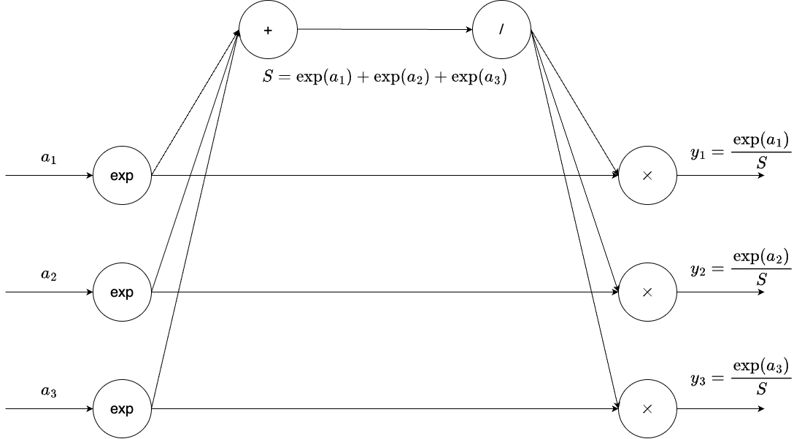
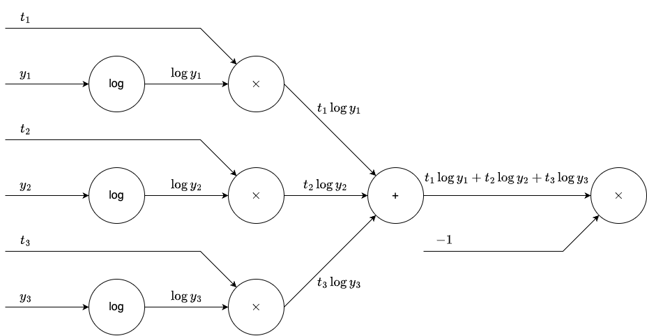
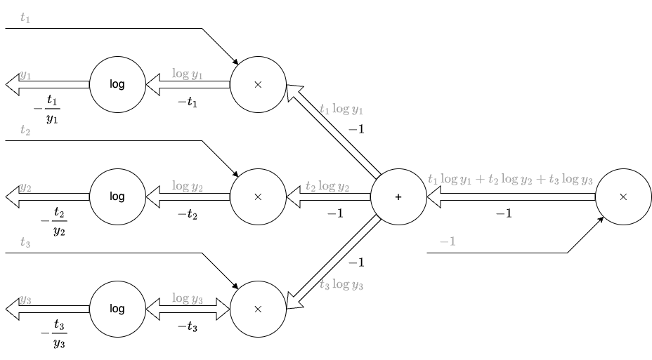

# softmax-with-loss 계층

softmax 계층과 교차 엔트로피 오차 계층을 합친 계층을 softmax-with-loss 계층이라고 한다.

## 순전파

### softmax 계층

softmax 계층의 수식은 다음과 같다.
$$y_k = \frac{\exp(a_k)}{\sum_{i=1}^{n}\exp(a_i)}$$

### 교차 엔트로피 오차 계층

교차 엔트로피 오차 계층의 수식은 다음과 같다.
$$L = -\sum_{k} t_k \log y_k$$

## 역전파

### 교차 엔트로피 오차 계층

교차 엔트로피 오차 계층의 역전파는 다음과 같다.
$$\frac{\partial L}{\partial y_k} = -\frac{t_k}{y_k}$$

### softmax 계층

> exp 노드에서는 다음과 같은 식이 성립한다.
> $$y = \exp(x)$$
> $$\frac{\partial y}{\partial x} = \exp(x)$$

