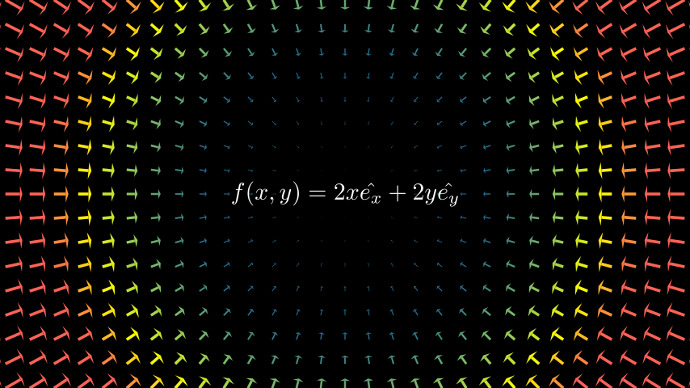
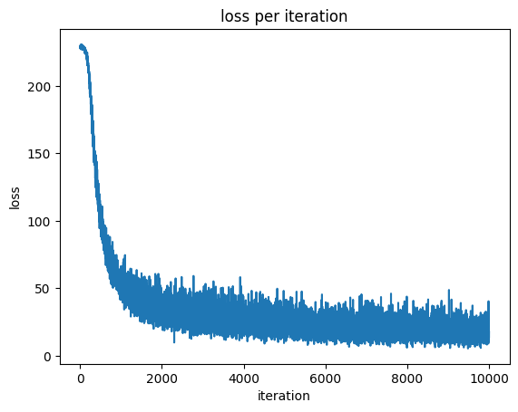
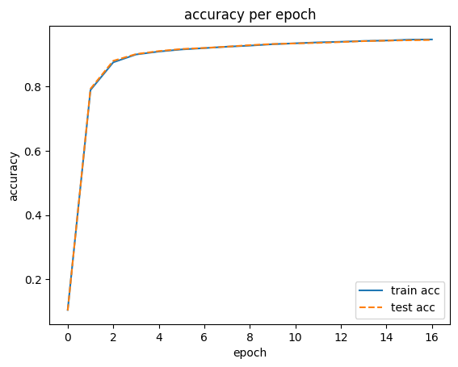
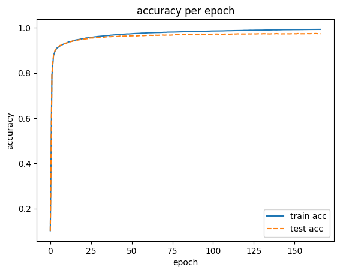

# Neural network training


Training means automatically acquiring the optimal values of the weight parameters from the training data. In order for a neural network to learn, it must have a metric, which is called a **loss function**. In other words, training is finding the weight parameters that minimize the loss function.

## Learning from data

Neural networks learn from data. In other words, the values of the weight parameters are automatically determined by looking at the data. In the logic gate implemented with the perceptron, at most three parameters were used. However, in actual neural networks, tens of thousands to hundreds of billions of parameters are used. These parameters cannot be set manually by humans.


When solving a problem, especially when looking for a pattern, it is common for humans to think and find the answer. However, in machine learning, human intervention is minimized, and patterns are found from the collected data.

In the problem of recognizing numbers from images, humans want to extract **features** from the image and learn the pattern of the feature using machine learning techniques. A feature is a transformer designed to accurately extract essential data from input data. Features are usually represented as vectors. SVM, KNN, etc. are used to convert data into vectors using these features and learn using the transformed vectors.

> SVM(Support Vector Machine): Learns linear or non-linear decision boundaries to classify data

> KNN(K-Nearest Neighbors): Finds the K nearest neighbors to the given input vector and classifies them

In machine learning, machines find rules from data. Since it is more efficient to design algorithms from scratch, there is less burden on humans.

In neural networks, images are learned as they are. In machine learning, features are designed by humans, but in neural networks, machines learn features themselves. That's why deep learning is also called end-to-end machine learning.

## Loss function

In neural network learning, the current state is represented by a single metric, which is called a loss function. Learning is the process of finding weight parameters that minimize the loss function. Although various functions can be used as loss functions, mean squared error and cross-entropy error are mainly used.

> The loss function is a metric that indicates how bad the performance of the neural network is.

### Sum of squares for error, SSE
$$
E = \frac{1}{2} \sum_{k} (y_k - t_k)^2
$$
```python
def sum_of_squares_error(y, t):
    return 0.5 * np.sum((y - t) ** 2)
```
The sum of squares is the most commonly used loss function. $y_k$ represents the output of the neural network, $t_k$ represents the correct label, and $k$ represents the dimension of the data.

### Cross-entropy error
$$
E = -\sum_{k} t_k \log y_k
$$
```python
def cross_entropy_error(y, t):
    delta = 1e-7
    return -np.sum(t * np.log(y + delta))
```

$y_k$ is the output of the neural network, and $t_k$ is the one-hot encoded correct label. Therefore, the cross-entropy error function becomes a formula that calculates the natural logarithm of the estimate.

## mini-batch learning


In machine learning, learning is the process of finding parameters that reduce the value of the loss function for training data. However, to do this, the loss function must be calculated for all training data. The cross-entropy error function for N data is as follows:

$$
E = -\frac{1}{N} \sum_n \sum_k t_{nk} \log y_{nk}
$$


However, the problem is that if the sum of the loss function is calculated for all data, too much time and computational power are required. In this case, some data can be selected and used as an approximation of the whole. These are called **mini-batches**.

A source code for mini-batches can be found [here](./src/mini-batch.ipynb).

## Why use a loss function


Why should we use a loss function? Wouldn't it be more intuitive to use an accuracy function?


In neural network learning, the goal is to find the parameter values that **minimize the loss function** as much as possible. To do this, the **derivative** of the parameters is calculated during learning, and the parameter values are updated based on the derivative values.


Here, the derivative of the weight parameter means how the loss function changes when the weight parameter is changed slightly. If the derivative value is negative, changing the weight parameter in the positive direction can reduce the loss function. The same is true in the opposite case. However, if the derivative value is 0, the update of the weight parameter stops.


> **Why accuracy is not used as a metric**: Accuracy does not respond to slight changes in parameters. Even if there is a response, the value changes discontinuously.

## Numerical differentiation

### Differential

Differential refers to the change at a specific moment. The derivative is the rate of change of a function at a specific point. The derivative of a function $f(x)$ is defined as follows:

$$
\frac{df(x)}{dx} = \lim_{h \to 0} \frac{f(x+h) - f(x)}{h}
$$

The simplest implementation of the derivative is as follows:

```python
def numerical_diff(f, x, h=1e-4):
    return (f(x + h) - f(x)) / h
```

This is not a good implementation when considering the error of the difference.

```python
def numerical_diff(f, x, h=1e-4):
    return (f(x + h) - f(x - h)) / (2 * h)
```

Forward difference and central difference: The errors of the two differentiation methods can be expressed in big O notation, and the central difference method has an error of O(h^2), while the forward/backward difference method has an error of O(h).
The error of the central difference method can be derived by using the Taylor series to approximate the error term.
First, if fx is expressed in terms of x_i+h using the Taylor series:

$$
f(x_i + h) = f(x_i) + hf'(x_i) + \frac{h^2}{2!}f''(x_i) + \frac{h^3}{3!}f'''(x_i) + O(h^4)
$$​	
Then, if fx is expressed in terms of x_i-h using the Taylor series:
$$
f(x_i - h) = f(x_i) - hf'(x_i) + \frac{h^2}{2!}f''(x_i) - \frac{h^3}{3!}f'''(x_i) + O(h^4)
$$
The central difference method can be obtained by adding the forward difference and backward difference and dividing by 2.
$$
\frac{f(x_i + h) - f(x_i - h)}{2h} = f'(x_i) + O(h^2)
$$
 Therefore, the central difference method has an error of O(h^2).
 

### Numerical differentiation

Very simple differentiation:

$$
y = 0.01x^2 + 0.1x
$$
Let's differentiate this.


Analytically, it can be differentiated as follows:
$$
\frac{dy}{dx} = 0.02x + 0.1
$$


### Partial differentiation


This is a function of two variables:

$$
f(x_0, x_1) = x_0^2 + x_1^2
$$


```python
def function(x):
    return np.sum(x**2)
```

This function's graph is as follows.


follows the partial derivative of this function with respect to $x_0$.

$$
\frac{\partial f}{\partial x_0} = 2x_0
$$

follows the partial derivative of this function with respect to $x_1$.

$$
\frac{\partial f}{\partial x_1} = 2x_1
$$

A partial derivative is a derivative of a function with multiple variables.
Like a derivative with one variable, it focuses on a specific variable and fixes the other variables.

### Gradient $\nabla$

A gradient is a vector that organizes the partial derivatives of all variables.


$
f(x0, x1) = x0^2 + x1^2
$

The gradient of the above function is as follows: $\nabla f(x) = (\frac{\partial f}{\partial x_0}, \frac{\partial f}{\partial x_1})$

This can be implemented as follows.
```python
def numerical_gradient(f, x):
    h = 1e-4
    grad = np.zeros_like(x)

    for idx in range(x.size):
        tmp_val = x[idx]
        x[idx] = tmp_val + h
        fxh1 = f(x)

        x[idx] = tmp_val -h
        fxh2 = f(x)

        grad[idx] = (fxh1 - fxh2) / (2*h)
        x[idx] = tmp_val
    return grad
```

### Gradient descent method

In neural networks, the optimal parameters must be found during the learning phase.
The optimal parameter value is the value of the parameter when the loss function is minimized. However, the loss function is generally very complex, and the parameter space is vast, so it is impossible to guess where the minimum value is.


One method that can be used in this situation is the **gradient descent method** using the gradient.

> However, the gradient does not guarantee that the minimum value of the function is in the direction it points.


The direction of the slope does not point to the minimum value, but it is best to go in that direction now.

In the gradient descent method, you move a certain distance in the direction of the slope from the current position. This process is repeated by moving a certain distance in the direction of the slope from the current position.

$$
x_0 = x_0 - \eta {\partial f\over \partial x_0}
$$
$$
x_1 = x_1 - \eta {\partial f\over \partial x_1}
$$

$\eta$ indicates the degree of updating and is called the learning rate. It determines how much to learn in one learning and how much to change the parameter value.
The gradient descent method can be implemented as follows.
```python
def gradient_descent(f, init_x, lr=0.01, step_num=100):
    x = init_x

    for i in range(step_num):
        grad = numerical_gradient(f, x)
        x -= lr * grad
    return x
```

Problem: Use the gradient descent method to find the minimum value of $f(x_0, x_1)=x^2_0 + x^2_1$!

Let's start from the initial value (-3, -4).
```python
def func(x):
    return x[0]**2 + x[1]**2

init_x = np.array([-3.0, -4.0])
gradient_descent(func, init_x, lr=0.1)
#>>array([-6.11110793e-10, -8.14814391e-10])
```


If the learning rate (lr) is too large:
```python
init_x = np.array([-3.0, -4.0])
gradient_descent(func, init_x, lr=10)
#>>array([-2.58983747e+13,  1.29524862e+12])
```

If the learning rate (lr) is too small:
```python
init_x = np.array([-3.0, -4.0])
gradient_descent(func, init_x, lr=1e-10)
#>>array([-2.99999994, -3.99999992])
```


> Parameters such as the learning rate are called hyperparameters. Unlike weights and biases, hyperparameters are not acquired or set by learning, but are parameters that must be set by humans. Generally, hyperparameters must be found by experimenting with several candidate values to find the best learning value.

## Gradient in neural networks

In neural networks, gradients must also be calculated. The gradient here refers to the slope of the loss function with respect to the weight parameters.

For example, consider a neural network with a shape of $2\times3$, weight $W$, and loss function $L$.

In this case, the gradient is $\frac{\partial L}{\partial W}$, which has a shape of $2\times3$.

$$
W = \begin{pmatrix} w_{11} & w_{21} & w_{31} \\ w_{12} & w_{22} & w_{32} \end{pmatrix}
$$
$$
\frac{\partial L}{\partial W} = \begin{pmatrix}
\frac{\partial L}{\partial w_{11}} & \frac{\partial L}{\partial w_{21}} & \frac{\partial L}{\partial w_{31}} \\
\frac{\partial L}{\partial w_{21}} & \frac{\partial L}{\partial w_{22}} & \frac{\partial L}{\partial w_{32}}
\end{pmatrix}
$$


Each element of $\frac{\partial L}{\partial W}$ is a partial derivative of each element. For example, it indicates how much the loss function $L$ changes when $w_{11}$ is changed slightly.
$$
\nabla L = \frac{\partial L}{\partial W}
$$

```python
class simpleNet:
    def __init__(self):
        self.W = np.random.randn(2, 3)
    
    def predict(self, x):
        return np.dot(x, self.W)
    
    def loss(self, x, t):
        z = self.predict(x)
        y = softmax(z)
        loss = cross_entropy_error(y, t)
        return loss
net = simpleNet()
x = np.array([0.6, 0.9])
dW = numerical_gradient(lambda w: net.loss(x, t), net.W)
print(dW)
```
```
[[ 0.15169573  0.22302616 -0.37472189]
 [ 0.2275436   0.33453925 -0.56208284]]
```

$dW$ has a shape of $2\times3$ as a result of ```numerical_gradient(f, net.W)```.

## Learning algorithm

```python
class TwoLayerNet:
    def __init__(self, input_size, hidden_size, output_size, weight_init_std=0.01):
        self.params = {}
        self.params['W1'] = weight_init_std * np.random.randn(input_size, hidden_size)
        self.params['b1'] = np.zeros(hidden_size)
        self.params['W2'] = weight_init_std * np.random.randn(hidden_size, output_size)
        self.params['b2'] = np.zeros(output_size)
        
    def predict(self, x):
        W1, W2 = self.params['W1'], self.params['W2']
        b1, b2 = self.params['b1'], self.params['b2']
        
        a1 = np.dot(x, W1) + b1
        z1 = sigmoid(a1)
        a2 = np.dot(z1, W2) + b2
        y = softmax(a2)
        
        return y

    def loss(self, x, t):
        y = self.predict(x)
        return cross_entropy_error(y, t)
    
    def accuracy(self, x, t):
        y = self.predict(x)
        y = np.argmax(y, axis=1)
        t = np.argmax(t, axis=1)
        
        accuracy = np.sum(y==t)/float(x.shape[0])
        return accuracy
    
    def numerical_gradient(self, x, t):
        loss_W = lambda w: self.loss(x, t)
        
        grads = {}
        grads['W1'] = numerical_gradient(loss_W, self.params['W1'])
        grads['b1'] = numerical_gradient(loss_W, self.params['b1'])
        grads['W2'] = numerical_gradient(loss_W, self.params['W2'])
        grads['b2'] = numerical_gradient(loss_W, self.params['b2'])
        
        return grads
```

Mini-batch learning is a method of randomly selecting some of the training data and updating the parameters using the gradient method for that mini-batch.
```python
from mnist import load_mnist
(x_train, t_train), (x_test, t_test) = load_mnist(normalize=True, one_hot_label=True)

train_loss_list = []

iters_num = 10
train_size = x_train.shape[0]
batch_size = 100
learning_rate = 0.1

network = TwoLayerNet(input_size=784, hidden_size=50, output_size=10)

for i in range(iters_num):
    print('iter: ', i)
    batch_mask = np.random.choice(train_size, batch_size)
    x_batch = x_train[batch_mask]
    t_batch = t_train[batch_mask]
    
    grad = network.numerical_gradient(train_size, batch_size)
    
    for key in ('W1', 'b1', 'W2', 'b2'):
        network.params[key] -= learning_rate * grad[key]
    
    loss = network.loss(x_batch, t_batch)
    train_loss_list.append(loss)
```



The graph shows that the loss function value decreases as the number of iterations increases. In other words, it means that learning is going well, and the weight parameters of the neural network are gradually adapting to the data.

### Evaluation
In the above graph, it was confirmed that the loss function value decreases as the training is repeated. However, the above loss function value is the '**loss function for the training data mini-batch**'.
It is not certain that the neural network is working properly with the above data alone.

In neural network learning, it is necessary to check whether the network correctly recognizes data other than the training data. To prevent so-called **overfitting**, the accuracy of the training data and test data is recorded regularly during learning.


> An epoch corresponds to the number of times the training data is exhausted during learning. For example, if 10,000 training data are learned with 100 mini-batches, 100 times is 1 epoch.



When checking the data, it can be seen that the accuracy of both the training data and the test data improves as the epoch progresses.


However, after an additional 100,000 learning sessions, it can be seen that the accuracy of the training data and the test data is improving, but there is a difference, which means that overfitting has occurred.