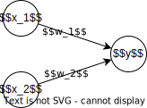
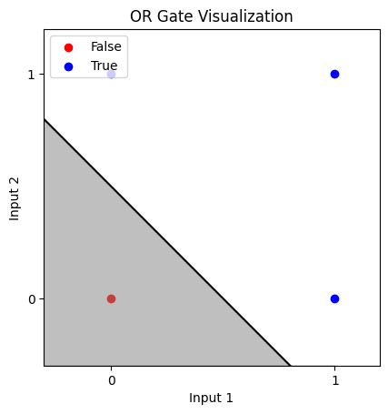
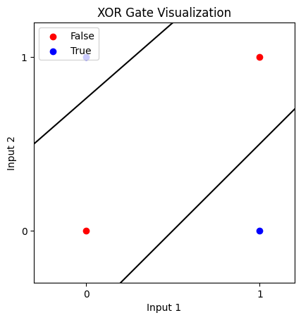

# Perceptron

## what is perceptron?

A perceptron takes in multiple signals and outputs a single signal.



A perceptron can be simply represented in the form shown above, where $x_1$, $x_2$ are the input signals, $y$ is the output signal, and $w_1$, $w_2$ are the weights.
The circles in the illustration are called neurons, or nodes.
As input signals reach the neuron, they are multiplied by the weights, and the results are added together.
If the sum exceeds a certain threshold, the neuron is activated and outputs a signal.

A formula for the above would look like this, and it's pretty straightforward:
$$
f(x) = \begin{cases}
    0 & \text{if } w_1x_1 + w_2x_2 \leq \theta \\
    1 & \text{if } w_1x_1 + w_2x_2 > \theta
\end{cases}
$$

A perceptron assigns a unique weight to each of multiple input signals, and since the weight is a factor that controls the influence of each signal on the outcome, the weight indicates that the signal is important.

## basic logic gates
### AND gate
An AND gate has two inputs and one output.

An AND gate outputs 1 only if both inputs are 1, otherwise it outputs 0.
|$x_1$|$x_2$|$y$|
|---|---|---|
|0|0|0|
|1|0|0|
|0|1|0|
|1|1|1|

### NAND gate

A NAND gate is the opposite of an AND gate. It outputs 0 only if both inputs are 1, otherwise it outputs
|$x_1$|$x_2$|$y$|
|---|---|---|
|0|0|1|
|1|0|1|
|0|1|1|
|1|1|0|

### OR gate

An OR gate outputs 1 if at least one of the inputs is 1.
|$x_1$|$x_2$|$y$|
|---|---|---|
|0|0|0|
|1|0|1|
|0|1|1|
|1|1|1|

## A simple perceptron
```python
# AND gates implemented in Python.
def AND(x1, x2):
    w1, w2, theta = 0.5, 0.5, 0.7
    tmp = x1*w1 + x2*w2
    if tmp <= theta:
        return 0
    else:
        return 1
```
$w_1, w_2$ and $\theta$ are the weights and threshold, respectively and initialized inside the function and return 1 if the weighted sum of the inputs is greater then or equal to the total of the inputs, otherwise return 0.

This is a simple perceptron that implements an AND gate.

### Weight and bias
The threshold $\theta$ can be rewritten as a bias $b = -\theta$. The bias is a value that determines how easy it is to activate the neuron. If the bias is large, the neuron is easily activated, and if it is small, the neuron is difficult to activate.
Weight is a value that determines the importance of the input signal. The larger the weight, the more important the signal is.

$$
y = \begin{cases}
    0 & \text{if } b + w_1x_1 + w_2x_2 \leq 0 \\
    1 & \text{if } b + w_1x_1 + w_2x_2 > 0
\end{cases}
$$
```python
# AND gates with weights and bias implemented in Python.
def AND(x1, x2):
    x = np.array([x1, x2])
    w = np.array([0.5, 0.5])
    b = -0.7
    tmp = np.sum(w*x) + b
    if tmp <= 0:
        return 0
    else:
        return 1
```

```python
# NAND gate and OR gate implemented in Python.
def NAND(x1, x2):
    x = np.array([x1, x2])
    w = np.array([-0.5, -0.5])
    b = 0.7
    tmp = np.sum(w*x) + b
    if tmp <= 0:
        return 0
    else:
        return 1
        
def OR(x1, x2):
    x = np.array([x1, x2])
    w = np.array([0.5, 0.5])
    b = -0.2
    tmp = np.sum(w*x) + b
    if tmp <= 0:
        return 0
    else:
        return 1
```
## limits of perceptron

### XOR gate
An XOR gate is a gate that outputs 1 if the number of inputs that are 1 is odd, and 0 if it is even.
|$x_1$|$x_2$|$y$|
|---|---|---|
|0|0|0|
|1|0|1|
|0|1|1|
|1|1|0|

An XOR gate cannot be implemented with a single perceptron. This is because a single perceptron can only implement a linear function, and the XOR gate is a non-linear function.

#### Linear and non-linear functions
A linear function is a function that can be expressed as a straight line, and a non-linear function is a function that cannot be expressed as a straight line.


The OR gate splits the region with a single straight line, as you can see in the image above. This is a linear function.



But, the XOR gate cannot be split with a single straight line, as you can see in the image above. This is a non-linear function.

## Multi-layer perceptron
A multi-layer perceptron is a perceptron with multiple layers. It can implement non-linear functions by combining multiple perceptrons. The XOR gate can be implemented with a multi-layer perceptron.

### XOR gate implemented with a multi-layer perceptron
```python
# XOR gate implemented with a multi-layer perceptron in Python.
def XOR(x1, x2):
    s1 = NAND(x1, x2)
    s2 = OR(x1, x2)
    y = AND(s1, s2)
    return y
```

The XOR gate is implemented by combining the NAND and OR gates with an AND gate.
NAND, OR, and AND gates are all perceptrons, and the XOR gate is implemented by combining multiple perceptrons.
so, the XOR gate is called a multi-layer perceptron.


