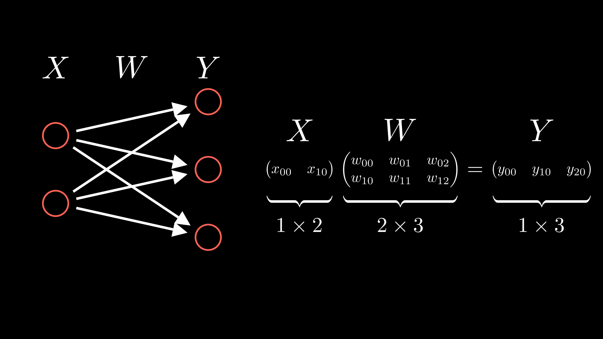
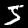

# Neural Network


## How do neural networks pass signals?

A formula for a perceptron would look like this:
$$
y = \begin{cases}
0 & (b + w_1x_1 + w_2x_2 \leq 0) \\
1 & (b + w_1x_1 + w_2x_2 > 0)
\end{cases}
$$


## activation function

Simplyfy expressions by writing conditional branches as functions
$$
h(x) = \begin{cases}
0 & (x \leq 0) \\
1 & (x > 0)
\end{cases}
$$
$$
y = h(b + w_1x_1 + w_2x_2)
$$

A function like h(x) is called a step function. A step function outputs 1 if its input is greater than 0 and 0 otherwise. Now let's use an activation function instead of a step function  

## Logic gate and activation function
이제 활성화 함수를 사용하여 논리 게이트를 구현해보자.
먼저 입력은 $x_1$과 $x_2$로 하고, 가중치는 $w_1=0.5$과 $w_2=0.5$로 하자. 그리고 편향 $b=0.7$로 하자.
$$
y = h(0.7 + 0.5 x_1 + 0.5x_2)
$$

### Sigmoid function
$$
h(x) = \frac{1}{1 + \exp(-x)}
$$
The sigmoid function is often used in neural networks and allows you to send a signal continuously by scaling the output to a value between 0 and 1.


### 계단 함수
$$
h(x) = \begin{cases}
0 & (x \leq 0) \\
1 & (x > 0)
\end{cases}
$$
계단함수는 입력이 0을 넘으면 1을 출력하고, 그 외에는 0을 출력한다.


### Sigmoid Vs Step function


## Non-linear function
계단함수와 시그모이드 함수는 둘다 비선형 함수이다. 신경망에서는 비선형 함수를 사용하여 신경망의 깊은 층 효과를 얻을 수 있다. 선형함수를 사용한다면, 신경망이 깊어져도 단층 신경망과 같은 효과를 얻을 수 있다.

### ReLU function

ReLU 함수는 입력이 0을 넘으면 그 입력을 그대로 출력하고, 그 외에는 0을 출력한다.
$$
h(x) = \begin{cases}
x & (x > 0) \\
0 & (x \leq 0)
\end{cases}
$$


## Matrix multiplication in neural networks

신경망에서는 행렬의 곱을 계산하는 것이 매우 중요하다. (행렬의 곱에 관한 내용은 [여기](./multidimensional_array_operation.md)서 확인하시라. )


파이썬 코드로 구현하면 다음과 같이 구현할 수 있다.
```python
X = np.array([1, 2])
W = np.array([[1, 3, 5], [2, 4, 6]])
Y = np.dot(X, W)
```

## 3층 신경망
이전보다 조금은 더 복잡한 3층 신경망을 구현해본다.


```python
def init_network():
    network = {}
    network['W1'] = np.array([[0.1, 0.3, 0.5], [0.2, 0.4, 0.6]])
    network['b1'] = np.array([0.1, 0.2, 0.3])
    network['W2'] = np.array([[0.1, 0.4], [0.2, 0.5], [0.3, 0.6]])
    network['b2'] = np.array([0.1, 0.2])
    network['W3'] = np.array([[0.1, 0.3], [0.2, 0.4]])
    network['b3'] = np.array([0.1, 0.2])

    return network

def forward(network: dict, x:np.array):
    W1, W2, W3 = network['W1'], network['W2'], network['W3']
    b1, b2, b3 = network['b1'], network['b2'], network['b3']
    
    a1 = x@W1 + b1
    z1 = sigmoid(a1)
    a2 = z1@W2 + b2
    z2 = sigmoid(a2)
    a3 = z2@W3 + b3
    y = a3
    return y
    
def sigmoid(x):
    return 1 / (1 + np.exp(-x))

if __name__ == '__main__':
    network = init_network()
    x = np.array([1.0, 0.5])
    y = forward(network, x)
    print(y)
```

## Output layer
### 항등함수
identity function은 입력을 그대로 출력하는 함수이다.
$$
\sigma(x) = x
$$

### softmax function
softmax function은 입력 값을 정규화하여 출력한다.
$$
y_k = \frac{\exp(a_k)}{\sum_{i=1}^{n} \exp(a_i)}
$$
함수의 분자는 입력 신소 $a_k$의 지수함수, 분모는 모든 입력 신호의 지수 함수의 합으로 구성되고, 모든 입력 신호로부터 영향을 받는다. 이러한 특성으로 인해 softmax function은 출력값을 확률로 해석할 수 있다.
```python
def softmax(a):
    exp_a = np.exp(a)
    sum_exp_a = np.sum(exp_a)
    y = exp_a / sum_exp_a
    return y
```

## 손글씨 인식

### MNIST 데이터셋
MNIST 데이터셋은 손글씨 숫자 이미지 집합으로, 0부터 9까지의 숫자 이미지로 구성되어 있다. 각 이미지는 28x28 크기의 회색조 이미지이다. 이 데이터셋은 60,000개의 훈련 데이터와 10,000개의 테스트 데이터로 구성되어 있다.

[여기](./src/img_show.py)의 코드를 사용하여 다음과 같은 이미지를 확인 할 수 있다.




### MNIST 추론
이제 MNIST 데이터 셋을 사용하여 추론을 해보자.
먼저 신경망를 input neuron 784개, output neuron 10개로 구성한다. 그리고 hidden layer를 2개 사용한다. 첫번째 hidden layer는 50개의 neuron을, 두번째 hidden layer는 100개의 neuron을 사용한다. hidden layer는 임의로 정한 값이기 때문에 다른 값으로 설정해도 무방하다.

소스코드는 [여기](./src/mnist_nueralnet.py)에서 확인하시라.
실행 결과로는 
```bash
Accuracy: 0.9352
```
이 출력된다.

올바르게 분류한 비율이 93.52%라는 뜻이다.
**놀랍다.** 3층 신경망으로도 이런 결과를 얻을 수 있다니!
단 182KB 용량의 모델로 이런 결과를 얻었다.

또한 이렇게 행렬을 사용하여 추론을 하는 과정을 **순전파(forward propagation)** 이라고 한다.

### Batch processing

수치계산 라이브러리 대부분이 큰 배열을 효과적으로 처리할 수 있기 때문에 배치 처리를 사용하면 계산 속도를 높일 수 있다. 예를들어 위의 코드에서는 x에 대하여 for문을 사용하여 각각의 이미지를 처리하고 있다.
$$
X(784) \times W_1(784\times50) + b_1(50) = A_1(50)
$$
$$
A_1(50) \times W_2(50\times100) + b_2(100) = A_2(100)
$$
$$
A_2(100) \times W_3(100\times10) + b_3(10) = Y(10)
$$

그러나 x를 100개의 이미지로 묶어서 처리하면 다음과 같이 계산할 수 있다.
$$
X(100\times784) \times W_1(784\times50) + b_1(50) = A_1(100\times50)
$$
$$
A_1(100\times50) \times W_2(50\times100) + b_2(100) = A_2(100\times100)
$$
$$
A_2(100\times100) \times W_3(100\times10) + b_3(10) = Y(100\times10)
$$

배치처리하는 소스코드는 [여기](./src/batched_mnist.ipynb)에서 확인하시라.