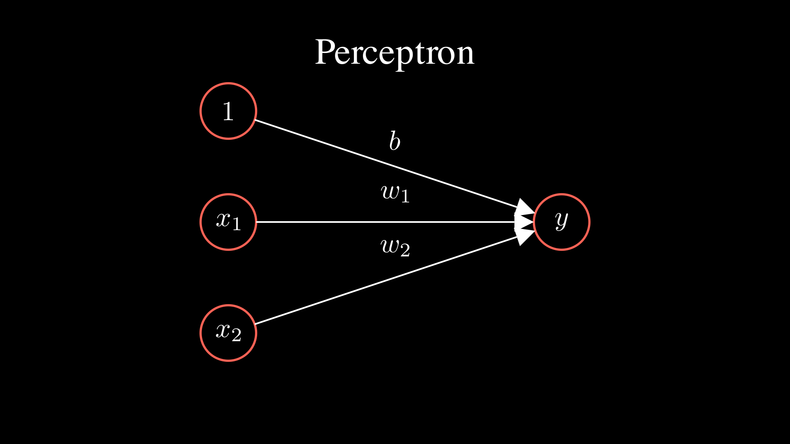
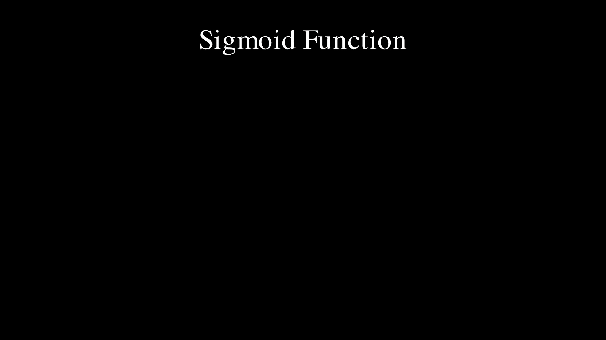
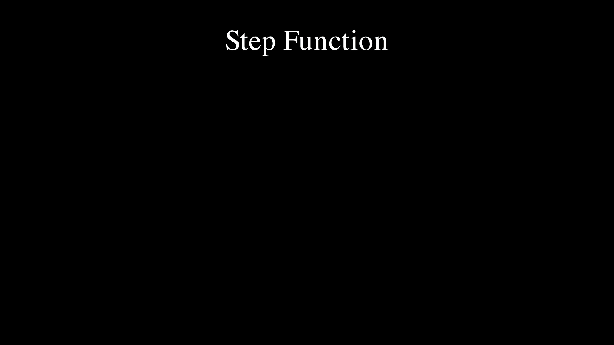
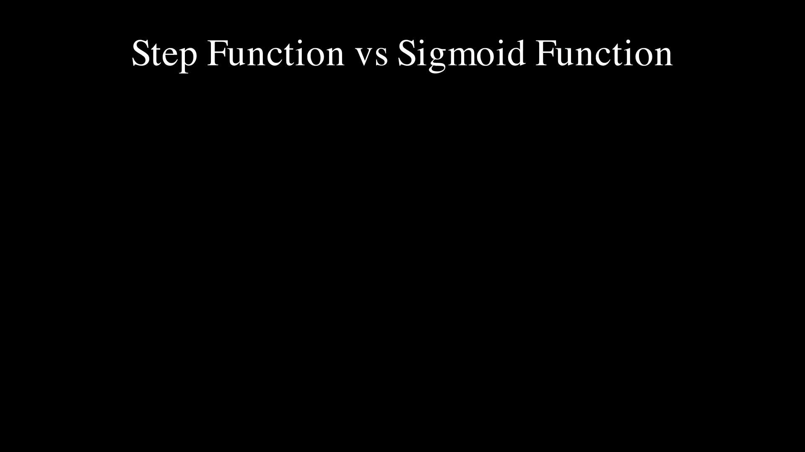
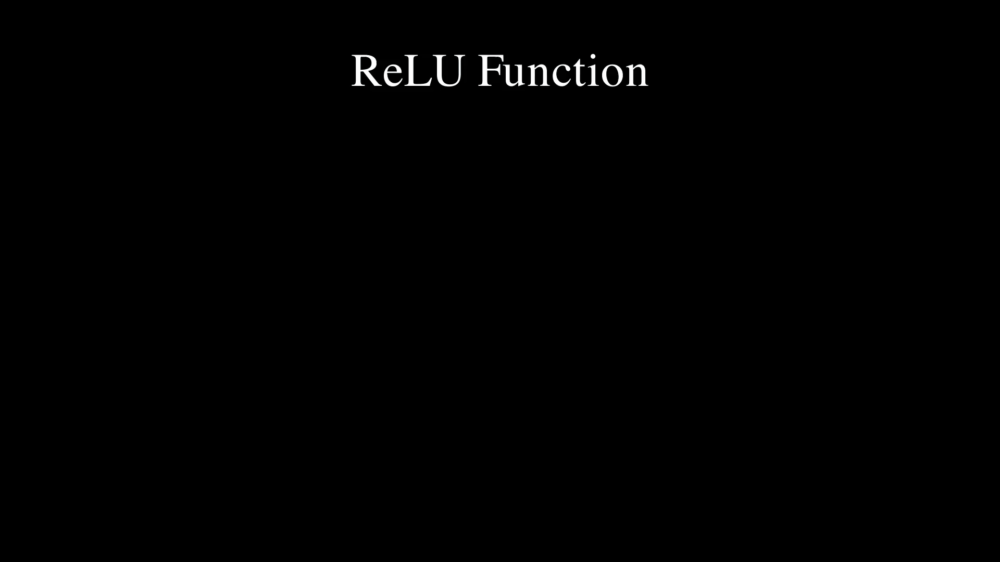

# Neural Network

## How do neural networks pass signals?

A formula for a perceptron would look like this:
$$
y = \begin{cases}
0 & (b + w_1x_1 + w_2x_2 \leq 0) \\
1 & (b + w_1x_1 + w_2x_2 > 0)
\end{cases}
$$

## activation function

Simplyfy expressions by writing conditional branches as functions
$$
h(x) = \begin{cases}
0 & (x \leq 0) \\
1 & (x > 0)
\end{cases}
$$
$$
y = h(b + w_1x_1 + w_2x_2)
$$

A function like h(x) is called a step function. A step function outputs 1 if its input is greater than 0 and 0 otherwise. Now let's use an activation function instead of a step function  

### Sigmoid function
$$
h(x) = \frac{1}{1 + \exp(-x)}
$$
The sigmoid function is often used in neural networks and allows you to send a signal continuously by scaling the output to a value between 0 and 1.

### 계단 함수
$$
h(x) = \begin{cases}
0 & (x \leq 0) \\
1 & (x > 0)
\end{cases}
$$
계단함수는 입력이 0을 넘으면 1을 출력하고, 그 외에는 0을 출력한다.

### Sigmoid Vs Step function

## Non-linear function
계단함수와 시그모이드 함수는 둘다 비선형 함수이다. 신경망에서는 비선형 함수를 사용하여 신경망의 깊은 층 효과를 얻을 수 있다. 선형함수를 사용한다면, 신경망이 깊어져도 단층 신경망과 같은 효과를 얻을 수 있다.

### ReLU function

ReLU 함수는 입력이 0을 넘으면 그 입력을 그대로 출력하고, 그 외에는 0을 출력한다.
$$
h(x) = \begin{cases}
x & (x > 0) \\
0 & (x \leq 0)
\end{cases}
$$

