<!-- # 오차역전파법 -->

# Backpropagation

지금까지는 신경망의 가중치 매개변수에 대한 손실함수의 기울기를 수치 미분을 사용하여 구했다.
수치미분은 간단하지만 계산시간이 매우 오래걸린다.
오차역전파법을 사용하여 가중치 매개변구에 대한 손실함수의 기울기를 효율적으로 계산할 수 있다.

<!-- ## 계산 그래프 -->
## Computational Graph

그래프는 자료구조 그래프를 의미하며, 노드와 에지로 표현된다.

### 계산 그래프 문제

예제: 슈퍼에서 1개에 100원인 사과를 2개 샀다. 소비세가 10%일 때 지불 금액은?

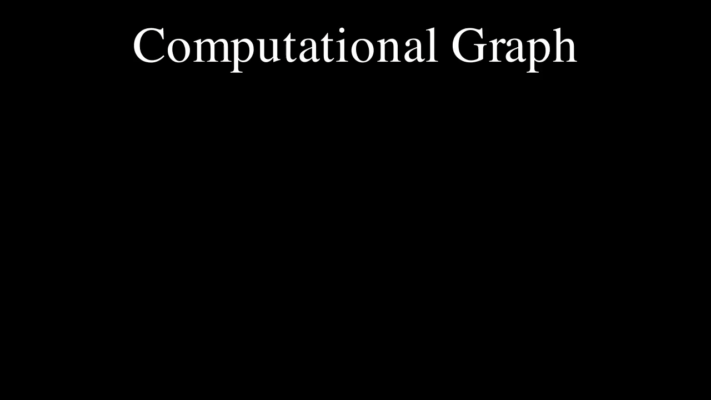

### 계산그래프 진행과정

1. 계산 그래프를 구성한다.
2. 그래프에서 계산을 왼쪽에서 오른쪽으로 진행한다.

여기서 계산을 왼쪽에서 오른쪽으로 진행하는 단계를 순전파라고 한다.
이름에서 알수 있듯이. 순전파가 있다면, 반대방향으로 진행하는 역전파도 있다.

### 국소적 계산

계산 그래프는 '국소적 계산'을 전파함으로써 최종 결과를 얻는다. 국소적 계산은 전체에서 어떤 일이 벌어지든 상관없이 자신과 관련된 정보만으로 결과를 출력할 수 있다는 것이다.

핵심은 각 노드에서의 계산은 국소적이라는 점이다.

### 계산 그래프를 사용하는 이유

1. 국소적 계산: 각 노드에서의 계산은 국소적이다.
2. 중간 계산 결과를 모두 보관할 수 있다.
3. **역전파를 통해 미분을 효율적으로 계산할 수 있다.**

위의 문제에서 만약 사과의 가격이 오르는 경우 최종금액에 어떤 영향을 미치는지 알고 싶다고 하자.
이는 '사과 가격에 대한 지불금액의 미분'을 구하는 문제이다.
사과 값을 $x$, 지불금액을 $L$이라 하면, 이 문제는 $\frac{\partial L}{\partial x}$를 구하는 문제이다.

'사과 가격에 대한 지불 금액의 미분'은 계산 그래프에서 역전파를 하면 구할 수 있다.

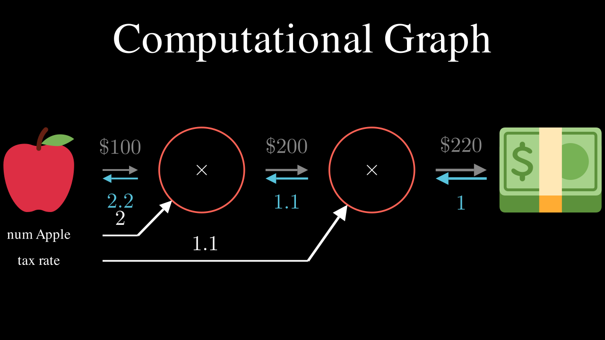

위 그림에서 '사과 가격에 대한 지불금액의 미분'은 2.2이다.
사과가 1원 오르면 최종금액은 2.2원 오른다는 뜻이다.

## 연쇄법칙

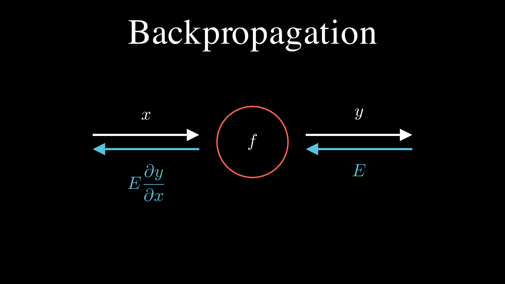

순전파에서는 계산 결과를 왼쪽에서 오른쪽으로 전달하지만, 역전파에서는 '국소적인 미분'을 오른쪽에서 왼쪽으로 전달한다. 

$y=f(x)$계산에 대해서 역전파 계산 절차는 신호 $E$에 $f'(x)$를 곱한 후 다음 노드로 전달하는 것이다.
이 방식을 따르면 목표로 하는 미분 값을 연쇄법칙의 원리로 효율적으로 구할 수 있다.

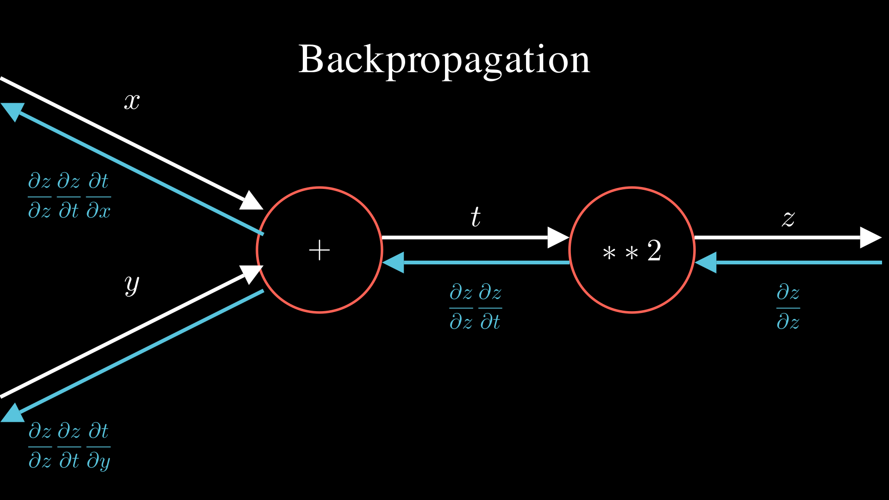

## 계층 구현
### 곱셈 계층
모든 계층은 forward()와 backward()라는 공통의 메서드를 갖도록 구현한다.

```python
class MulLayer:
    def __init__(self):
        self.x = None
        self.y = None
    
    def forward(self, x, y):
        self.x = x
        self.y = y
        out = x * y
        return out
    
    def backward(self, dout):
        dx = dout * self.y
        dy = dout * self.x
        return dx, dy
```

```python
apple = 100
apple_num = 2
tax = 1.1

mul_apple_layer = MulLayer()
mul_tax_layer = MulLayer()

apple_price = mul_apple_layer.forward(apple, apple_num)
price = mul_tax_layer.forward(apple_price, tax)

print(price) # 220
```

```python
dprice = 1
dapple_price, dtax = mul_tax_layer.backward(dprice)
dapple, dapple_num = mul_apple_layer.backward(dapple_price)

print(dapple, dapple_num, dtax) # 2.2 110 200
```

### 덧셈 계층
```python
class AddLayer:
    def __init__(self):
        pass
    
    def forward(self, x, y):
        out = x+y 
        return out
    
    def backward(self, dout):
        dx = dout
        dy = dout
        return dx, dy
```

### 나숫셈 계층
```python
class DivLayer:
    def __init__(self):
        self.x = None
        self.y = None
    
    def forward(self, x, y):
        self.x = x
        self.y = y
        out = x / y
        return out
    
    def backward(self, dout):
        dx = dout * 1 / self.y
        dy = dout * -self.x / self.y**2
        return dx, dy
```
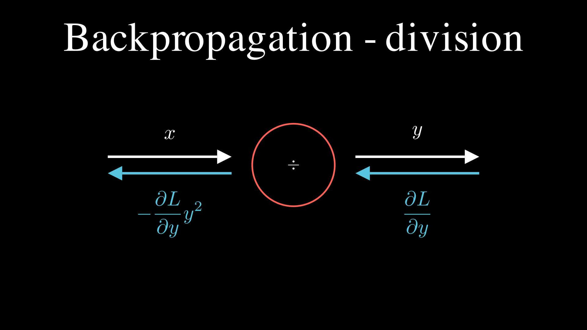

## 활성화 함수 계층

### ReLU 계층
활성화 함수로 사용되는 ReLU의 수식과 그 미분은 다음과 같다.
$$
y = \begin{cases}
x & (x > 0) \\
0 & (x \leq 0)
\end{cases}
$$
$$
\frac{\partial y}{\partial x} = \begin{cases}
1 & (x > 0) \\
0 & (x \leq 0)
\end{cases}
$$
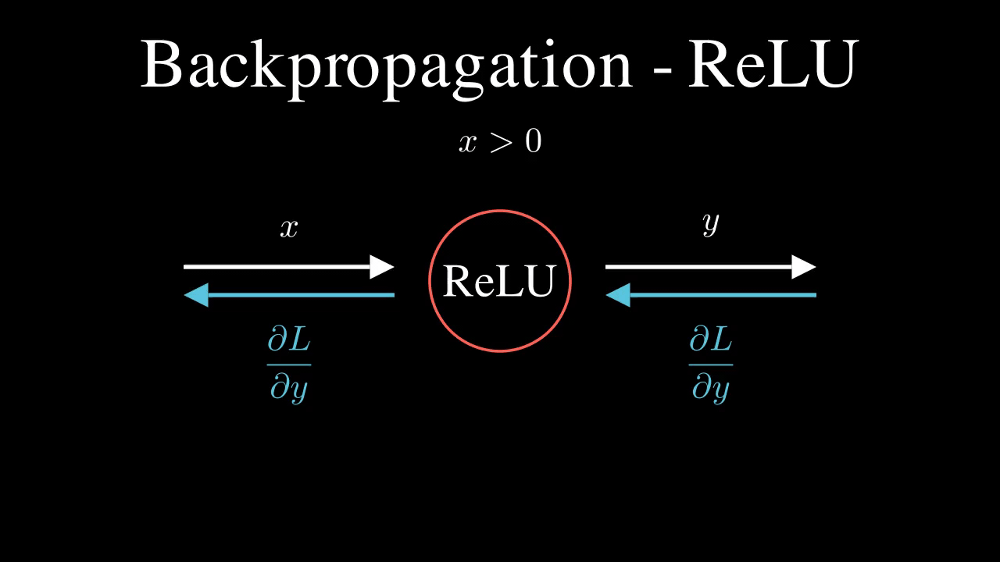

```python
class Relu:
    def __init__(self):
        self.mask = None

    def forward(self, x):
        self.mask = (x <= 0)
        out = x.copy()
        out[self.mask] = 0

        return out

    def backward(self, dout):
        dout[self.mask = 0]
        dx = dout
        return dx
```

### Sigmoid 계층

$$
y = \frac{1}{1+exp(-x)}
$$

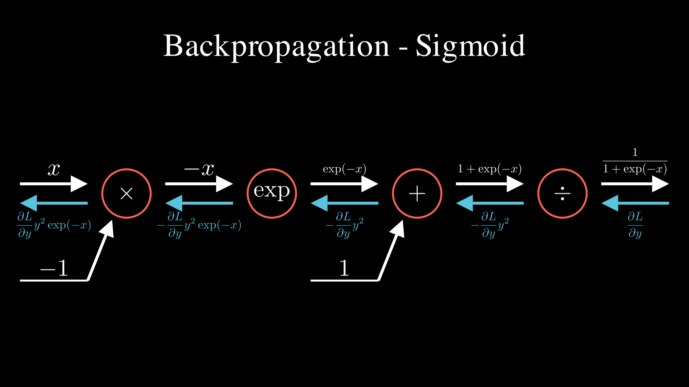
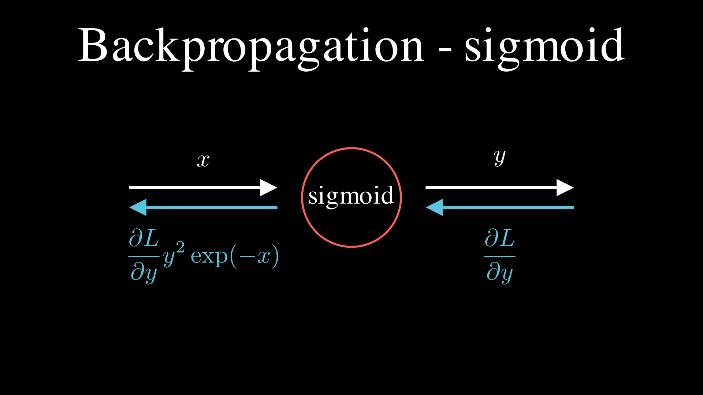

```python
class Sigmoid:
    def __init__(self):
        self.out = None
    
    def forward(self, x):
        out = 1 / (1 + np.exp(-x))
        self.out = out
        return out
    
    def backward(self, dout):
        dx = dout * (1.0 - self.out) * self.out
        return dx
```

## Affine/Softmax 계층

행렬의 곱과 편향의 합을 계산그래프로 그려보면 다음과 같다.
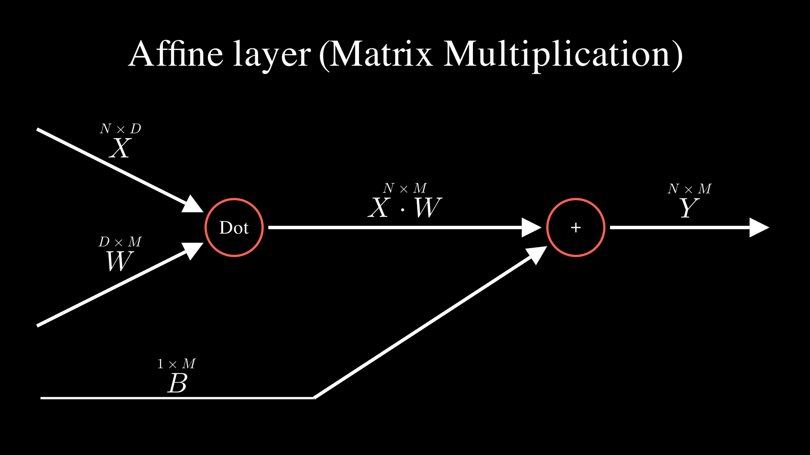

지금까지는 노드사이의 값이 스칼라였지만, 이번에는 행렬로 확장된다.
행렬을 사용한 역전파도 행렬의 원소마다 계산을 반복하면 된다.

$$
\frac{\partial L}{\partial \mathbf X} = \frac{\partial L}{\partial \mathbf Y} \cdot \mathbf W^T
$$
$$
\frac{\partial L}{\partial \mathbf W} = \mathbf X^T\cdot \frac{\partial L}{\partial \mathbf Y}
$$

[ Y = XW ]

여기서 Y의 각 원소 ( y_{ij} )는 다음과 같이 표현됩니다:

$$y_{ij} = \sum_{k} x_{ik} w_{kj} $$

이제, L에 대한 X의 기울기 dL/dX를 계산하기 위해, L에 대한 Y의 기울기 dL/dY를 알고 있다고 가정합니다. 그러면:

$$ \frac{\partial L}{\partial X_{ij}} = \sum_{k} \frac{\partial L}{\partial Y_{ik}} \frac{\partial Y_{ik}}{\partial X_{ij}} $$

여기서 Y의 각 원소에 대해 X의 원소에 대한 미분은 W의 전치 행렬이 됩니다:

$$\frac{\partial Y_{ik}}{\partial X_{ij}} = W_{kj}$$

따라서:

$$\frac{\partial L}{\partial X_{ij}} = \sum_{k} \frac{\partial L}{\partial Y_{ik}} W_{kj}$$

이를 행렬 형태로 표현하면:

$$\frac{\partial L}{\partial X} = \frac{\partial L}{\partial Y} W^T$$

가 된다.

## Softmax-with-Loss 계층
소프트 맥스 함수는 입력값을 정규화 하여 출력한다.

이전에 MNIST 추론에서의 순전파는 다음과 같이 이루어진다.
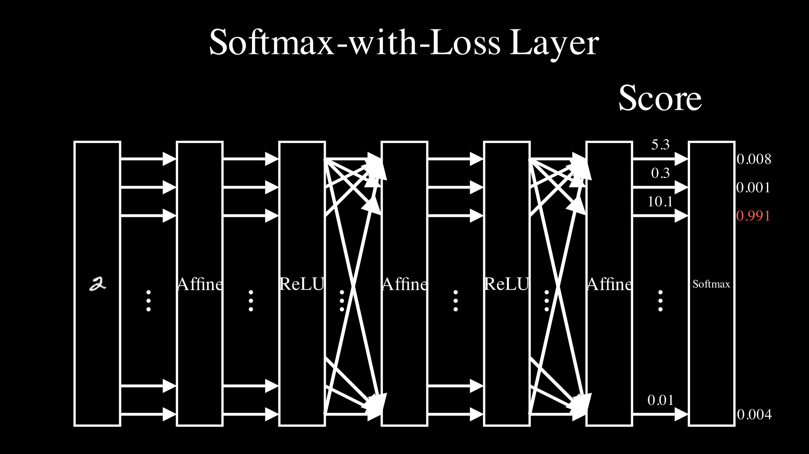

softmax계층은 입력값을 정규화 한다. 이때 손실함수로 교차 엔트로피 오차를 포함하여 softmax-with-loss계층이라고 한다.

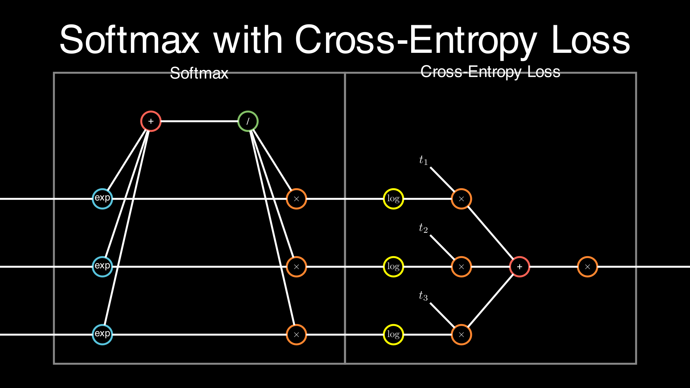

간소하게 표현된 softmax-with-loss계층은 다음과 같이 나타낼 수 있다.

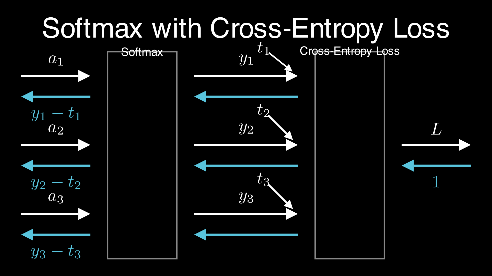

softmax 계층은 $(a_1, a_2, a_3)$을 정규화 하여$(y_1, y_2, y_3)$를 출력한다.

교차 엔트로피 오차 계층은 softmax의 출력과 정답 레이블을 받고 이 데이터들로 부터 손실 L을 출력한다.

그런데 여기서 softmax와 교차 엔트로피 오차를 같이 사용하는 이유를 알 수 있다.
바로 softmax계층의 역전파가 $(y_1-t_1, y_2-t_2, y_3-t_3)$라는 결과를 얻을 수 있다.즉 softmax계층의 출력과 정답 레이블의 차이인 오차가 출력된다.

```python
class SoftmaxWithLoss:
    def __init__(self):
        self.loss = None
        self.y = None
        self.t = None

    def forward(self, x, t):
        self.t = t
        self.y = softmax(x)
        self.loss = cross_entropy_error(slef.y, self.t)
        return self.loss
    
    def backward(self, dout=1):
        batch_size = self.t.shape[0]
        dx = (self.y - self.t) / batch_size
        return dx
```

### 신경망 학습의 전체 구조
1. 미니배치: 훈련 데이터 중 일부를 무작위로 가져온다.
2. 기울기 산출: 미니배치의 손실함수 값을 줄이기 위 해 각 가중치 매개변수의 기울기를 구한다.
3. 매개변수 갱신: 기울기를 사용하여 가중치 매개변수를 갱신한다.
4. 반복: 1~3단계를 반복한다.