# 매개변수 갱신기법

신경망 학습은 손실함수의 값을 낮추는 매개변수를 찾는 과정이며, 이를 최적화라고 한다.

매개변수 공간은 매우 넓고 복잡하기 때문에 굉장히 어려운 문제이다.

수식을 풀어서 최적의 매개변수를 구하는 방법은 없다.

지금까지는 매개변수를 찾는 단서로 기울기를 이용했다. 이 방법은 확률적 경사 하강법(SGD)라고 한다.

수식으로는 다음과 같다

$$
\mathbf{W} \leftarrow \mathbf{W} - \eta \frac{\partial L}{\partial \mathbf{W}}
$$

```python
class SGD:
    def __init__(self, lr=0.01):
        self.lr = lr

    def update(self, params, grads):
        for key in params.keys():
            params[key] -= self.lr * grads[key]
```

```python
network = TwoLayerNet(...)
optimizer = SGD()

for i in range(10000):
    ...
    x_batch, t_batch = get_mini_batch(...)
    grads = network.gradient(x_batch, t_batch)
    params = network.params
    optimizer.update(params, grads)
    ...
```

optimizer를 사용하면 다른 최적화 기법으로 쉽게 교체할 수 있다.
위 코드에서는 SGD를 사용하였고, 최적화를 담당하는 클래스를 분리하므로서 기능을 모듈화 하여 새로운 최적화 기법을 쉽게 적용할 수 있다.

### SGD의 단점
SGD는 비등방성 함수에서는 탐색 경로가 비효율적이기 때문에 더 좋은 방법이 필요하다.

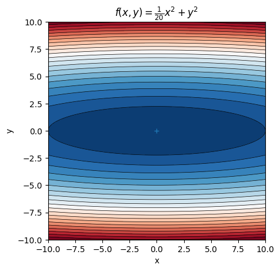
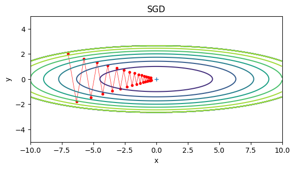

## 모멘텀

모멘텀은 운동량을 의미하고 수식으로는 다음과 같다.

$$
\mathbf{v} \leftarrow \alpha \mathbf{v} - \eta \frac{\partial L}{\partial \mathbf{W}}
$$
$$
\mathbf{W} \leftarrow \mathbf{W} + \mathbf{v}
$$

$\mathbf{v}$는 속도를 의미한다.
1983년 발표된 기법으로 SGD에 비해 지그재그 정도가 덜하다.

기존 SGD에 관성을 추가하는 방식이다.
* 진동 감소
* 빠른 수렴
* 지역 최적화 회피

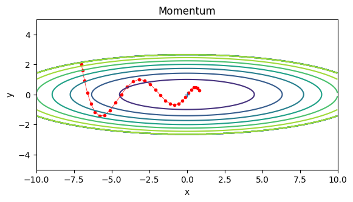

```python
class Momentum:
    def __init__(self, lr=0.01, momentum=0.9):
        self.lr = lr
        self.momentum = momentum
        self.v = None

    def update(self, params, grads):
        if self.v is None:
            self.v = {}
            for key, val in params.items():
                self.v[key] = np.zeros_like(val)
        
        for key in params.keys():
            self.v[key] = self.momentum * self.v[key] - self.lr * grads[key]
            params[key] += self.v[key]
```

## AdaGrad
2011

학습률은 너무 작으면 학습시간이 길어지고, 너무 크면, 학습이 제대로 이루어지지 않는다.

Adagrad는 학습을 진행하면서 학습률을 줄여가는 방법이다.

학습률 감소(learning rate decay)방법에서는 매개변수 전체의 학습률 값을 일괄적으로 낮추지만,
Adagrad는 각각의 매개변수에 적응형 학습률을 만들어준다.

$$
\mathbf{h} \leftarrow \mathbf{h} + \frac{\partial L}{\partial \mathbf{W}} \odot \frac{\partial L}{\partial \mathbf{W}}
$$
$$
\mathbf{W} \leftarrow \mathbf{W} - \eta \frac{1}{\sqrt{\mathbf h}}\frac{\partial L}{\partial \mathbf{W}}
$$

$\odot$(hadamard product)는 행렬의 원소별 곱을 의미한다. 

많이 움직인 원소는 학습률이 많이 낮아지고, 조금 움직인 원소는 학습률이 조금만 낮아진다.

```python
class AdaGrad:
    def __init__(self, lr=0.01):
        self.lr = lr
        self.h = None

    def update(self, params, grads):
        if self.h is None:
            self.h = {}
            for key, val in params, items():
                self.h[key] = np.zeros_like(val)
        for key in params.keys():
            self.h[key] += grads[key] * grads[key]
            params[key] -= self.lr * grads[key] /np.sqrt(self.h[key]) + 1e-7
```

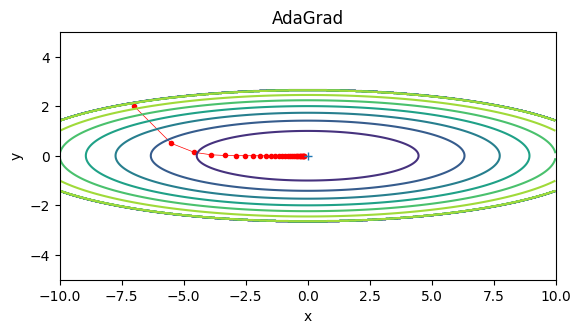

## Adam
2015
모멘텀은 관성을 갖고, AdaGrad는 각각의 매개변수에 적응적으로 학습률을 조정한다.
Adam은 두 기법을 융합한 기법이다.

다만 매우 복잡한 수식을 사용하기 때문에 구현이 복잡하고 직관적이진 않다.

```python
class Adam:

    def __init__(self, lr=0.001, beta1=0.9, beta2=0.999):
        self.lr = lr
        self.beta1 = beta1
        self.beta2 = beta2
        self.iter = 0
        self.m = None
        self.v = None
        
    def update(self, params, grads):
        if self.m is None:
            self.m, self.v = {}, {}
            for key, val in params.items():
                self.m[key] = np.zeros_like(val)
                self.v[key] = np.zeros_like(val)
        
        self.iter += 1
        lr_t  = self.lr * np.sqrt(1.0 - self.beta2**self.iter) / (1.0 - self.beta1**self.iter)         
        
        for key in params.keys():
            self.m[key] += (1 - self.beta1) * (grads[key] - self.m[key])
            self.v[key] += (1 - self.beta2) * (grads[key]**2 - self.v[key])
            
            params[key] -= lr_t * self.m[key] / (np.sqrt(self.v[key]) + 1e-7)
```

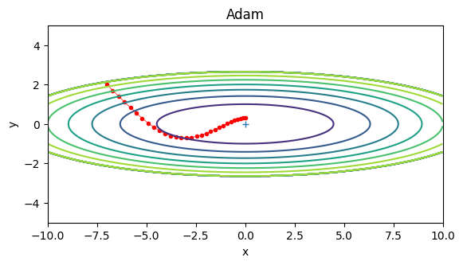

모든 문제에서 항상 뛰어난 방법은 존재하지 않는다.
SGD는 50년대 개발되었지만, 단순하고 구현이 쉽기 때문에 여전히 많이 사용되고 있으며,
모멘텀은 로컬 미니마를 탈출하기 쉽기때문에 많이 사용된다.
Adam은 모멘텀과 AdaGrad의 장점을 융합한 방법이지만, 모든 문제에서 항상 뛰어난 성능을 보여주지는 않는다.
AdaGrad는 학습률이 너무 작아져서 학습이 끝나는 경우가 있어 잘 사용하진 않지만, 시도해볼 가치는 있다..
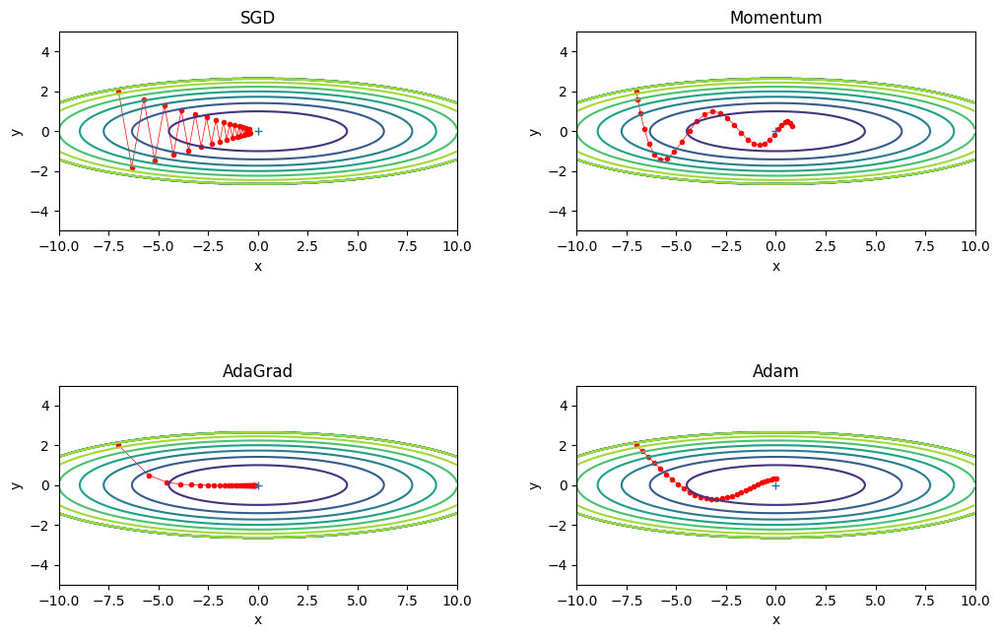

## MNIST 데이터셋

MNIST 손글씨 숫자 인식을 위의 네 기법으로 비교해보면 다음과 같은 학습 곡선을 볼 수 있다.

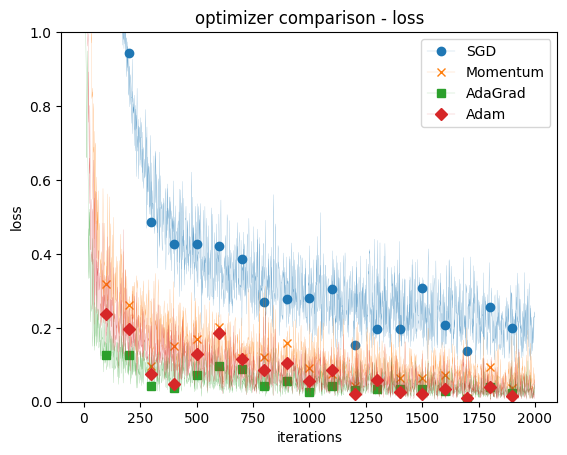

SGD가 가장 학습이 느리고, AdaGrad가 가장 빠르다고 볼 수 있다.

# 가중치 초깃값

가중치의 초깃값은 학습에 매우 중요하다. 가중치의 초깃값을 무엇으로 설정하느냐에 따라 학습 속도나 정확도가 크게 달라진다.

가중치 감소 테크닉은 오버피팅을 억제해 범용 성능을 높일수 있다. 가중치 매개변수의 값이 작아지도록 학습시켜 오버피팅이 일어나지 않게 하는 방법이다.(릿지 회귀와 비슷)

가중치를 작게하는 가장 기본적인 방법은 초깃값을 가장 작은값 0으로 시작하는 것이다. 하지만 가중치의 초기값을 모두 0으로 설정하면 학습이 올바로 이루어지지 않는다.

이유는 대칭성 문제(Symmetry Problem)가 발생하여 역전파 과정에서 모든 가중치가 똑같이 갱신되기 때문이다.
가중치 대칭적 구조를 무너뜨리기 위해서는 가중치를 무작위로 설정해야 한다.

## 은닉층의 활성화 값 분포

활성화 함수로 시그모이드 함수를 사용하는 5층 신경망에 무작위로 생성한 입력 데이터를 흘려서 각 층의 활성화 값 분포를 히스토그램으로 그려보면 다음과 같다.

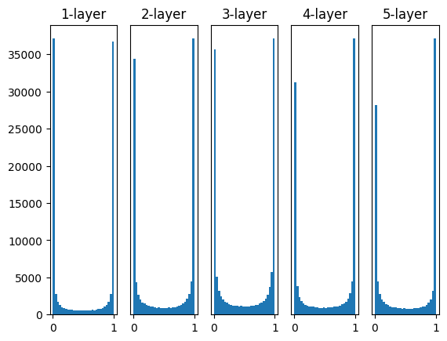

각 층의 활성화 값들이 0과 1에 치우쳐 분포되어 있는 것을 확인 할 수 있다.

시그모이드 함수는 출력이 0또는 1에 가까워지면 미분이 0에 가까워지기 때문에 역전파의 기울기 값이 점점 작아지다가 사라진다. 이를 기울기 소실(gradient vanishing)이라고 한다.

$$
\sigma(x) = \frac{1}{1 + \exp(-x)}
$$
$$
\frac{\partial \sigma(x)}{\partial x} = \sigma(x)(1 - \sigma(x))
$$

층을 깊게 하는 딥러닝에서 기울기 소실은 심각한 문제를 야기할 수 있다.

가중치의 표준편차를 0.01로 바꾸어 다시 그려보면 다음과 같다.

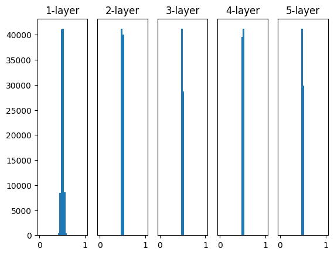

0.5 부근에 집중되어 있기 때문에, 기울기 소실 문제는 발생하지 않지만, 활성화 값이 치우쳐져 있기 때문에 표현력 관점에서 문제가 발생한다.

대다수의 뉴런이 거의 같은 값을 출력하고 있기 때문에 뉴런을 여러 개 둔 의미가 없어진다.

자비에르 글로로트와 요슈아 벤지오는 2010년에 논문에서 가중치의 초깃값을 적절히 설정하면 효율적인 학습이 가능하다는 것을 밝혔다.
각 층의 활성화 값들을 광범위하게 분포시키기 위해서는 앞 층의 노드가 n개인 경우 표준편차가 $\frac{1}{\sqrt{n}}$인 정규분포를 사용하면 된다.

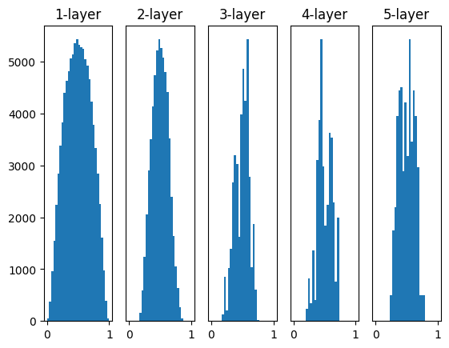

## ReLU를 사용할 때의 가중치 초깃값

Xavier 초깃값은 활성화 함수가 선형인 경우를 전제한다. ReLU 에서는 Xavier 초깃값이 적당하지 않다.
ReLU를 사용할 때는 특화된 초기값, He 초깃값을 사용한다. (카이밍 히의 이름을 따 He 초깃값)

앞 계층의 노드가 n개일 때, 표준편차가 $\sqrt{\frac{2}{n}}$인 정규분포를 사용한다.


표준편차가 0.01인 정규분포를 가중치 초깃값으로 사용한 경우


Xavier 초깃값을 사용한 경우

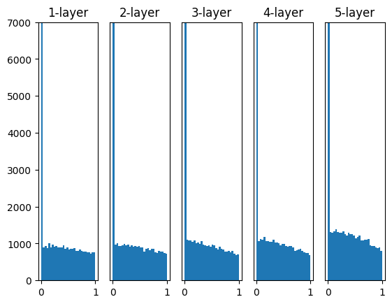

He 초깃값을 사용한 경우

$std = 0.01$인경우 각 층의 활성화 값들으 매우 작아서 학습이 제대로 이루어지지 않는다.

Xavier 초깃값은 층이 깊어지면서 점점 치우쳐지는 것을 확인 할수 있다. 층이 깊어질수록 치우침이 커지고 기울기 소실 문제가 발생할 수 있다.

He 초깃값은 모든 층에서 균일하게 분포되어 있다.

### MNIST

위에서 살펴본 3가지 가중치 초기화 방법을 사용해서 MNIST 데이터셋을 학습해보면 다음과 같은 결과를 얻을 수 있다.

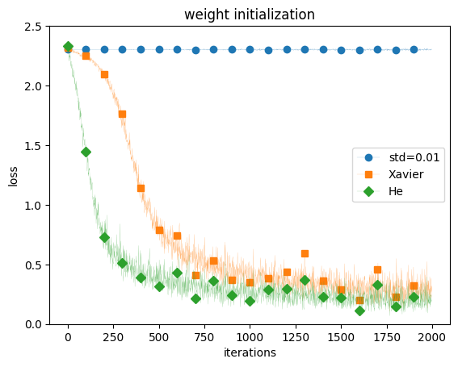

표준 편자가 0.01인 경우 학습이 전혀 이루어 지지 않았으며, Xavier 초깃값과 He 초깃값은 학습이 잘 이루어졌다.


# 배치 정규화

배치 정규화는 2015년 제안된 방법으로, 각 층의 활성화 값이 적당히 분포되도록 강제로 조정하는 방법이다.

* 학습속도를 높인다.
* 초깃값에 크게 의존하지 않는다.
* 오버피팅을 억제한다.

배치 정규화의 기본 아이디어 각 층의 활성화 값이 적당히 분포되도록 조정하는 것이다.

데이터 분포를 정규화 하는 배치 정규화 계층(Bath Normalization Layer)을 신경망에 삽입한다.

$$
\mu_B \leftarrow \frac{1}{m} \sum_{i=1}^{m} x_i
$$

미니 배치에 있는 모든 데이터 $x_i$의 평균을 구한다.
$\mu_B$는 미니배치의 평균이다.

$$
\sigma^2_B \leftarrow \frac{1}{m} \sum_{i=1}^{m} (x_i - \mu_B)^2
$$

각 데이터 $x_i$가 평균 $\mu_B$로 부터 얼마나 떨어져 있는지 분산($\sigma^2_B$)을 구한다.
$$
\hat{x}_i \leftarrow \frac{x_i - \mu_B}{\sqrt{\sigma^2_B + \epsilon}}
$$

각 데이터 $x_i$에서 평균($\mu_B$)을 빼고, 표준편차($\sqrt{\sigma^2_B + \epsilon}$)로 나누어 정규화를 한다.

이러한 수식을 통해 데이터 분포가 덜 치우치게 되고, 학습이 잘 이루어지게 된다.

또한 배치 정규화 계층에서 고유한 확대/이동 변환을 수행한다.

$$
y_i \leftarrow \gamma \hat{x}_i + \beta
$$

MNIST데이터 셋을 사용하여 배치 정규화를 적용한 경우와 적용하지 않은 경우를 비교해보면 다음과 같다.

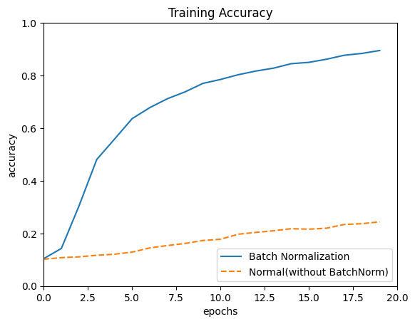

배치 정규화를 적용한 경우가 더 빠르게 학습이 되고, 정확도도 높게 나타난다.

다양한 매개변수 표준편차에 대해서 배치 정규화를 적용한 경우와 적용하지 않은 경우를 비교해보면 다음과 같다.

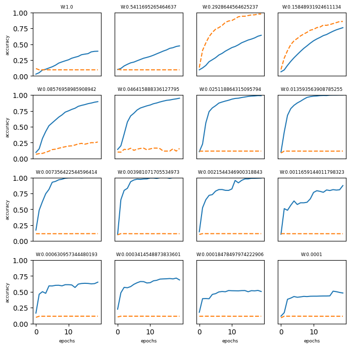

많은 경우 배치 정규화를 사용하는 것이 더 빠르게 학습이 되고, 정확도도 높게 나타난다.

또한 배치정규화를 하지 않은경우 가중치 초깃값에 민감하게 반응하는 것을 확인 할 수 있으며, 거의 학습되지 않는 경우도 있다.