# CNN

이미지 인식 분야에서 딥러닝을 활용한 기법은 거의 CNN을 기초로한다.

## CNN 개요

지금까지의 신경망은 인접하는 계층의 모든 뉴런과 결합되어 있었다. 이를 완전 연결(fully-connected)라고 한다. 바로 Affine계층이다. 

Affine 계층을 사용한 신경망은 다음과 같이 구현된다.

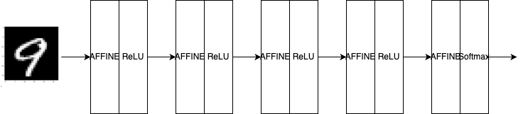

CNN은 **Convolution 계층**과 **Pooling 계층**이 추가된다.

## Convolution 계층

이미지는 width, hegith, channel(RGB)로 구성된다.
그러나 Affine 계층에서는 3차원 데이터를 1차원 데이터로 평탄화해줘야 한다.
공간적으로 가까운 픽셀에 대한 연관성, 채널의 상호 관련성, 이미지의 본질적인 특징을 무시하게 된다.
모든 입력 데이터를 동등한 뉴런으로 판단하기 때문에 형상에 관한 정보를 살릴 수 없다.

Convolution 계층은 입력 데이터의 형상을 유지한다. (3차원 데이터로 입력받아 3차원 데이터로 출력한다.)

Convolution 계층의 입출력 데이터는 특별히 **특징 맵(feature map)** 이라고 한다.

## 합성곱 연산

Conv 계층의 연산은 합성곱 연산이다. 합성곱 연산은 다음 그림과 같이 진행된다.

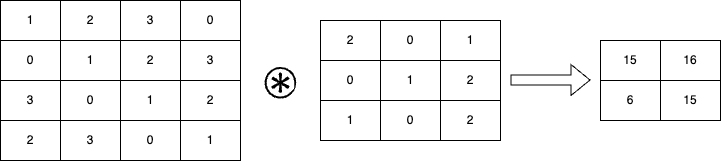

합성곱 연산은 입력데이터에 일종의 필터(커널)을 적용한다.
필터의 윈도우를 일정 간격으로 이동해가며 입력 데이터에 적용한다.
필터의 윈도우가 지나가는 곳에 대응하는 원소끼리 곱한 후 그 총합을 구한다.
**FMA**(Fused Multiply-Add) 연산이다.

CNN에서는 필터의 매개변수와 편향이 학습 대상이다. 단 CNN에서는 필터의 편향은 항상 하나만 존재한다. (1X1)

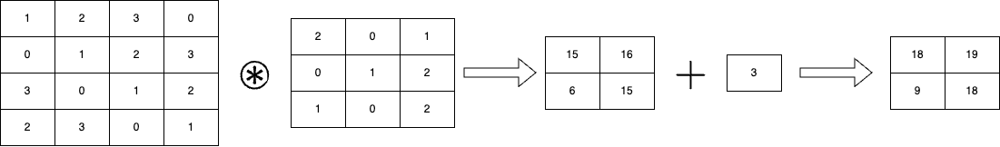

### 패딩(Padding)

합성곱 연산을 수행하기 전에 입력 데이터 주변을 0또는 특정 값으로 채우는 것을 패딩이라고 한다.

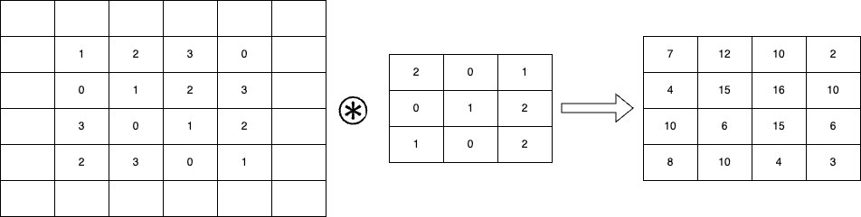

### 스트라이드(Stride)

필터를 적용하는 위치의 간격을 스트라이드라고 한다.

입력 크기를 (H, W), 필터 크기를 (FH, FW), 출력 크기를 (OH, OW), 패딩을 P, 스트라이드를 S라고 하면 출력 크기는 다음과 같다.

$$
OH = \frac{H + 2P - FH}{S} + 1
$$
$$
OW = \frac{W + 2P - FW}{S} + 1
$$
단, 출력 크기가 정수로 나누어 떨어지지 않을 때는 오류가 발생한다.
반올리, 내림, 올림 등의 방법을 사용한다.

### 3차원 데이터의 합성곱 연산
2차원 데이터는 흑백 이미지와 같다.
컬러 이미지는 3차원 데이터이다. (C, H, W)
3차원 데이터에 있어서 합성곱 연산에서는 필터의 채널 수와 입력 데이터의 채널 수가 같아야 한다. (C, FH, FW)

한 번의 합성곱 연산으로 모든 채널의 필터를 적용하고 그 결과를 더해서 하나의 출력을 만든다.

한 출력 데이터는 한장의 특징 맵이된다. (1, OH, OW)
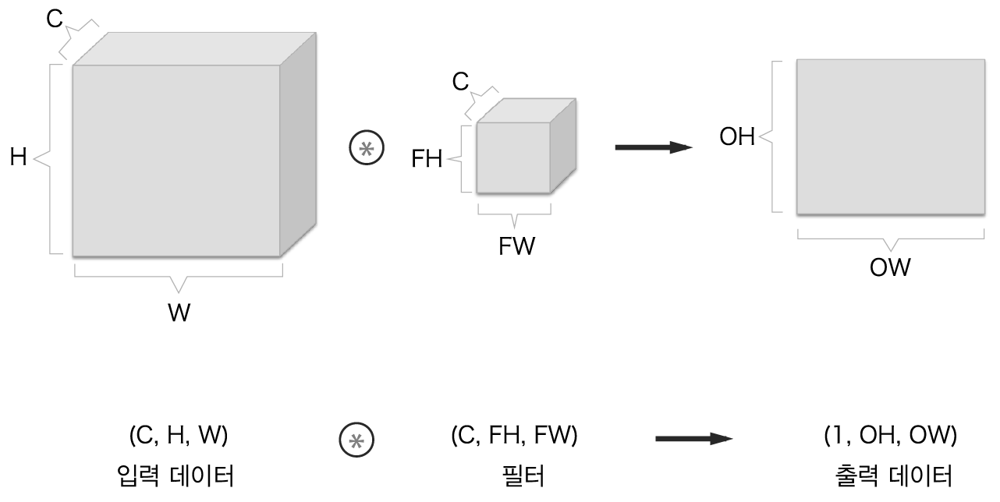

합성곱 연산으로 다수의 채널을 출력하기 위해서는 필터를 여러 개 사용한다.
(C, FH, FW) -> (FN, C, FH, FW) -> (FN, OH, OW)

필터를 FN개 사용하면 출력 데이터도 FN개가 된다.
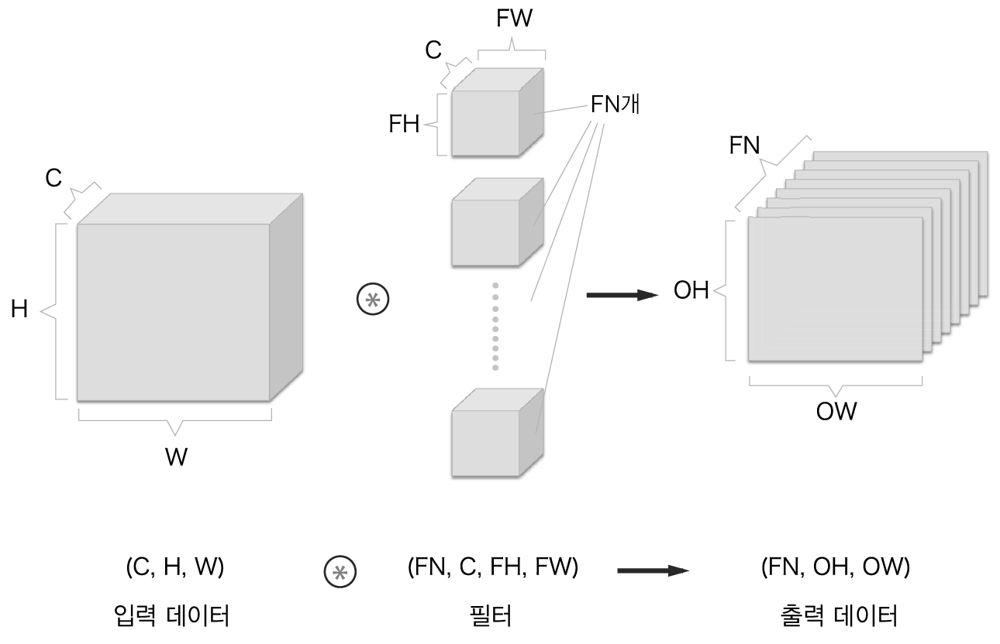

위 그림에서 볼수 있다싶이 필터의 가중치 데이터는 4차원 데이터이다. (FN, C, FH, FW)

전체적으로 CNN의 합성곱 계층은 다음과 같이 나타낼 수 있다.

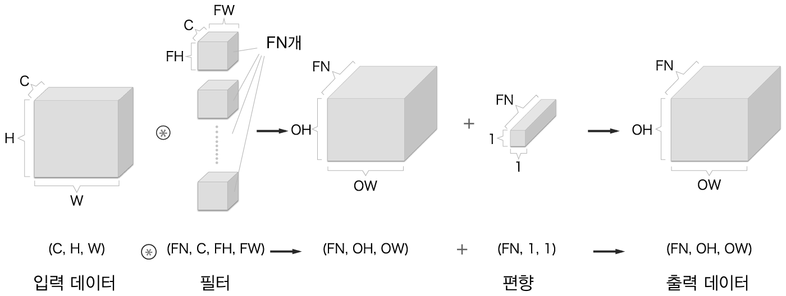

편향은 채널 하나에 값 하나로 구성되는 것을 확인할 수 있다.

입력데이터를 하나로 묶어 배치 처리하여 처리 효율을 높이고 신경망의 학습이 빨라질 수 있다.

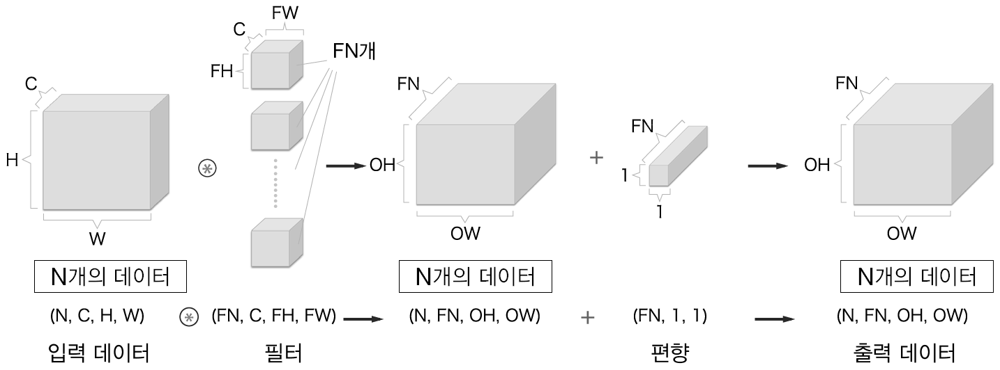

## 풀링 계층

풀링 계층은 세로, 가로 방향의 공간을 줄이는 연산이다.
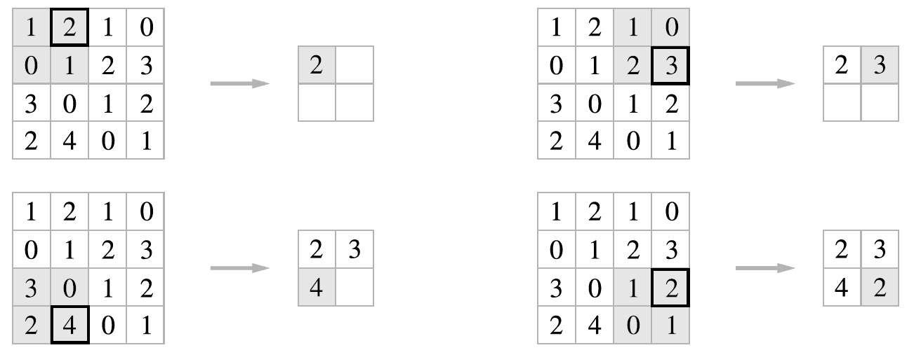

2x2 max pooling을 스트라이드 2로 처리하는 경우.

max pooling은 최대값을 구하는 풀링이다. 2x2 영역에서 최대값을 구하고 스트라이드 만큼 이동한다.

일반적으로 윈도우크기와 스트라이드는 같은 값을 사용한다.

> 풀링은 최대 풀링 이외에도 평균풀링 최소풀링 등이 있다.

### 풀링 계층의 특징

- 학습해야 할 매개변수가 없다.
- 채널 수가 변하지 않는다.
- 입력의 변화에 영향을 적게 받는다.(Robust)

## CNN 구현하기

### im2col 함수

합성곱 연산을 곧이 곧대로 구현하기 위해서는 중첩 for문을 사용해야 한다.
하지만 중첩 for문을 사용하면 계산량이 많아져서 느려진다.

im2col 함수를 사용하면 입력 데이터를 필터링하기 좋게 전개한다.

3차원 입력 데이터를 2차원 행렬로 바꾸어 계산한다.

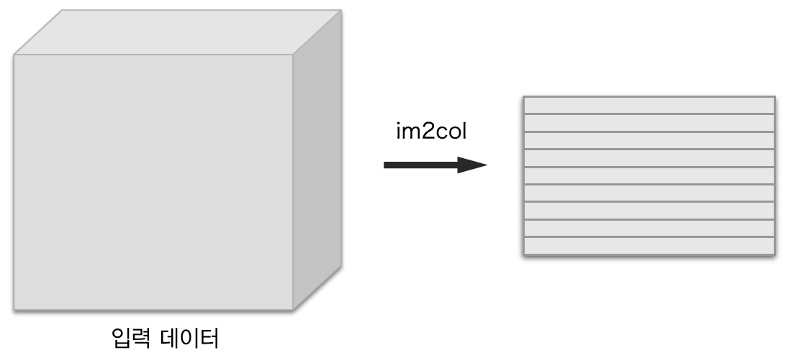

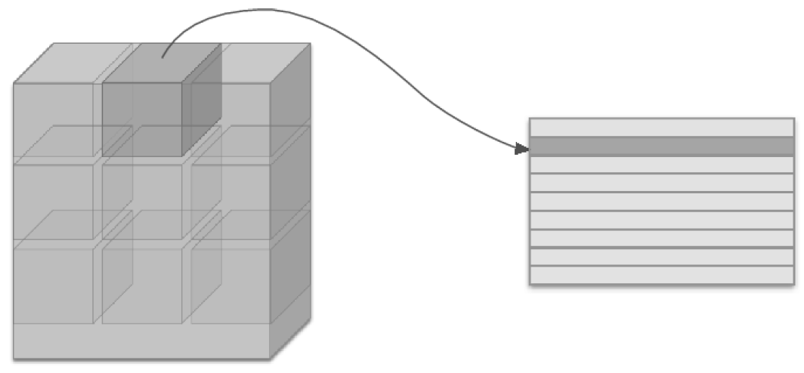

im2col은 필터링하기 좋게 입력 데이터를 전개하는데, 입력데이터에서 필터를 적용하는 영역을 한줄로 늘어놓는다.
im2col은 필터를 적용하는 모든 영역에서 수행한다.

그림과 같이 스트라이드를 크게 잡아서 필터의 적용 영역이 겹치지 않는 경우도 있지만, 일반적으로는 영역이 겹치는 경우가 대부분이다.
필터 적용 영역이 겹치게 되면 im2col로 전개한 후의 원소 수가 원래 블록의 원소 수보다 많아지게 되서, 메모리를 더 많이 사용하게 된다.
다만, 현대 행렬 계산 라이브러리들에서는 행렬 계산에 고도로 최적화 되어, 행렬의 곱셈을 빠르게 수행할 수 있기 때문에 문제를 행렬 계산으로 만들어 수행하는 것이 더 빠르다.

im2col로 입력 데이터를 전개한 후에는 합성곱 계층의 필터를 1열로 전개하고 두 행렬 곱을 수행한다.

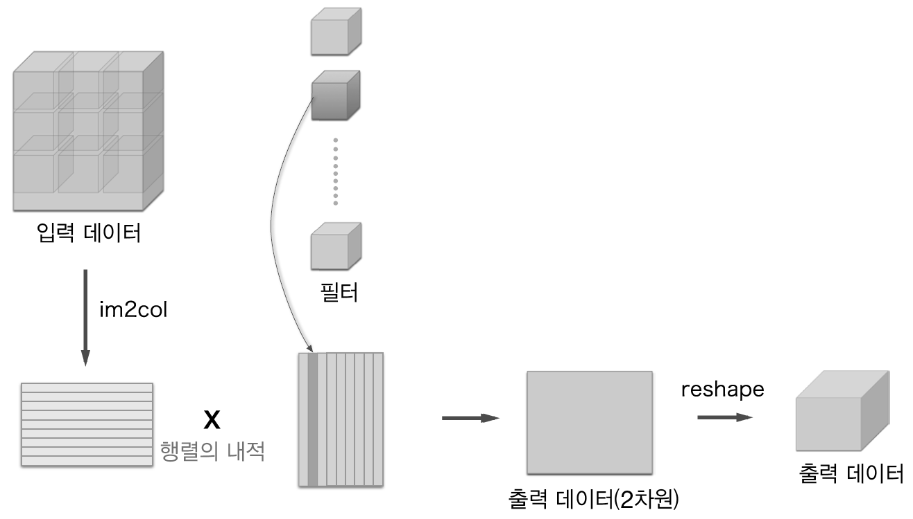