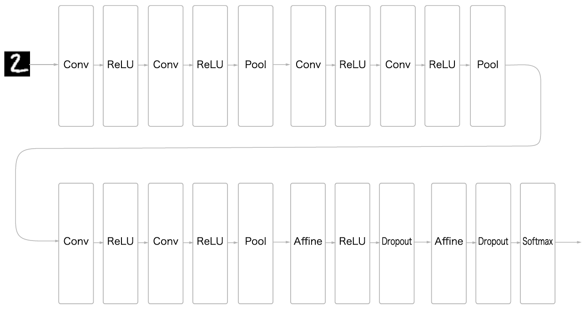
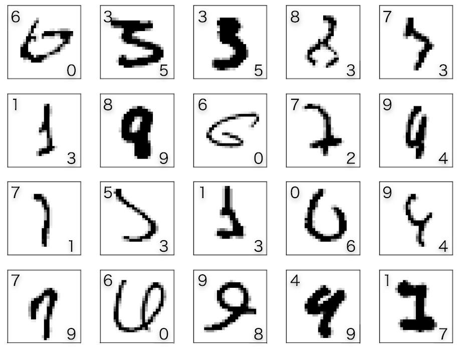
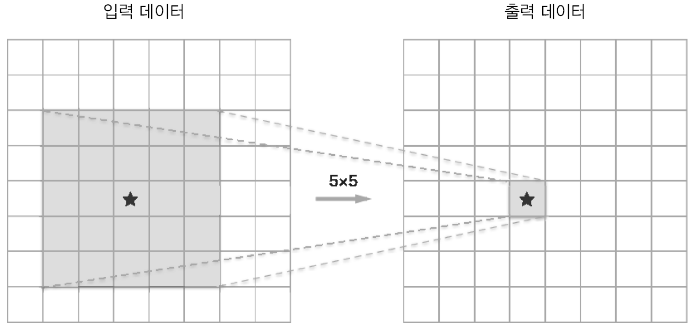
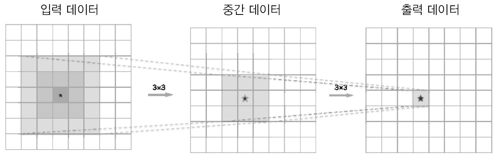

# Deeplearning

딥러닝은 층을 깊게 한 심층 신경망이다. 

## 8.1 more deeper

지금까지 학습한 기술들을 집약하여, 심층 신경망을 구축하고 MNIST 데이터셋을 학습시켜보자.

## 8.2 architecture


지금까지 진행했던 내용을 토대로 위와 같은 신경망을 구성한다.

합성곱 계층은 모두 3x3 크기의 필터를 사용하고, 층이 깊어질수록 채널 수도 증가한다.
(16, 16, 32, 32, 64, 64)

또한 풀링 계층에서는 중간 데이터의 공간 크기를 줄여주는 역할을 한다.

마지막 단의 완전연결 계층에서는 드롭아웃 계층을 사용한다.

가중치 초깃값으로는 HE 초깃값을 사용하고, optimizer로는 Adam을 사용한다.

[src](./src/deep_convnet.ipynb)

```bash
calculating test accuracy ... 
test accuracy:0.993
```

좌상단이 정답 레이블, 우하단은 추론 결과이다.

신경망의 정확도는 99.3%로, 이전까지의 신경망보다 높은 정확도를 보여준다.
또한 잘못 분류된 이미지를 보면, 사람도 헷갈릴만한 이미지들이다.

> MNIST데이터 셋에 대해서는 신경망의 깊이가 아주 깊지 않더라도, 최고 수준의 결과가 나오게 된다.
이는, 손글씨 숫자라는 문제가 단순하기 때문에 신경망의 표현력을 극한으로 끌어올리지 않아도 된다는 것을 의미한다. 반대로는 층을 깊게 하더라고 혜택이 적다고도 할 수 있다.

## Why deep?

'층을 깊게 하는 것'이 중요한 이유에 대한 근거는 부족하지만,
몇가지 설명할 수 있는 것들이 있다.

신경망의 매개변수 수가 줄어든다.
층을 깊게 한 신경망은 깊지 않은 경우보다 적은 매개변수로 같거나 더 나은 표현력을 달성할 수 있다.

예를들어 5x5필터로 구성된 합성곱 계층은 3x3필터로 구성된 합성곱 계층 두개로 대체할 수 있다.



5x5 필터를 사용하는 경우 25개의 매개변수가 필요하지만, 3x3필터를 사용하는 경우 18개의 매개변수만 필요하다.
이는 깊이가 깊어질수록 더 큰 차이를 보인다.

직관적으로는 앞단의 합성곱 계층에서는 엣지나 블롭같은 저수준의 정보를 추출하고, 뒷단의 합성곱 계층에서는 이런 저수준의 정보를 조합하여 더 고도의 정보를 추출한다.

만약 얕은 신경망을 사용한다면, 합성곱 계층에서 사물의 특징의 대부분을 `한번`에 이해하여야한다.

그러나 신경망을 깊게 하면 학습해야 할 문제를 계층적으로 분해하여, 각 층이 학습해야 할 문제를 단순한 문제로 대체할 수 있다.

또한 층을 깊게하면, 정보를 계층적으로 전달 할 수 있다. 에지를 추출한 다음층은 엣지에 대한 정보를 사용할 수 있고, 다음층으 엣지를 사용한 고도의 패턴을 효과적으로 학습하리라 기대할 수 있다.

