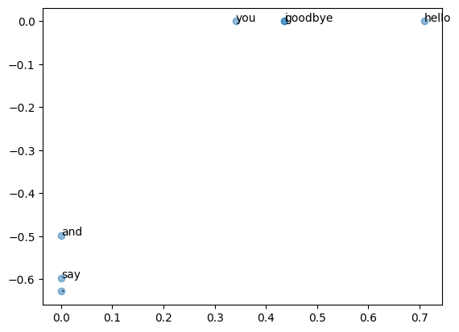

# NLP

## 자연어 처리

한국어와 영어등 평소에 사람이 사용하는 언어를 자연어(natural language)라고 한다.
자연어 처리(Natural Language Processing, NLP)는 이러한 자연어를 컴퓨터가 처리할 수 있도록 하는 기술이다.
컴퓨터가 이해할 수 있는 언어는 프로그래밍 언어, 마크업 언어 같은것이지만,
자연어는 사람이 사용하는 언어이기 때문에 컴퓨터가 이해하기 어렵다.

### 단어의 의미

자연어는 문자로 구성되며, 말의 의미는 단어로 구성된다.
단어는 의미의 최소 단위이기 때문에 자연어 처리에서는 단어의 의미를 이해시키는 것이 중요하다.

## 시소러스 thesaurus (유의어 사전)

`단어의 의미`를 나타내는 방법중 가장 간단한 방법은 사람이 직접 단어의 의미를 정의하는 것이다.
표준국어대사전처럼 각각 단어에 그 의미를 정의하는 것이다.
예를들어 `자동차`는 *원동기를 장치하여 그 동력으로 바퀴를 굴려서 철길이나 가설된 선에 의하지 아니하고 땅 위를 움직이도록 만든 차*라는 의미로 정의할 수 있다.
이런 식으로 단어들을 정의해두면 컴퓨터도 단어의 의미를 이해할수 있을 수 도 있다.

자연어 처리에서 인력을 동원해 단어의 의미를 정의하려는 시도는 수없이 많았다 단, `표준국어대사전`과 같은 사람이 사용하는 사전이 아닌 `시소러스` 형태의 사전을 만들어 사용하는 것이 일반적이다.

시소러스란 유의어 사전으로 *뜻이 같은 단어* 나 *뜻이 비슷한 단어* 가 한 그룹으로 분류되어 있다.

```
car = auto, automobile, machine, motorcar
```

또한 시소러스 중에는 단어사이의 `상위와 하위`나 `전체와 부분`과 같은 관계를 정의해둔 경우도 있다.

이렇게 모든 단어에 대해 유의어 집합을 만든다면, 단어들의 관계를 그래프로 표현할 수 있다.
이러한 그래프를 이용하면 단어의 의미를 컴퓨터에게 전달할 수 있다.

### 시소러스의 문제점

시소러스를 이용하면 단어의 의미를 이해시킬 수 있지만, 다음과 같은 단점들이 있다.
* 인력 소모가 크다.
    현존하는 영어 단어의 수는 1000만개가 넘어가고 있지만 가장 큰 시소러스도 20만개 정도의 단어만을 수록하고 있다.
* 단어의 의미를 정의하는 작업이 주관적이다.
    사람이 단어의 의미를 정의하는 작업은 주관적이기 때문에, 사람마다 의미를 다르게 정의할 수 있다.
* 단어의 의미가 시대에 따라 변한다.
    단어의 의미는 시대에 따라 변하기 때문에, 시대에 따라 단어의 의미를 계속해서 업데이트 해줘야 한다.

## 통계 기반 기법

맹목적으로 수집된 텍스트 데이터가 아닌 자연어 처리연구나 애플리케이션을 염두에 두고 수집된 텍스트 데이터를 `corpus`라고 한다.
이제 `corpus`를 사용하여 통계 기반 기법으로 단어의 의미를 이해하는 방법을 알아본다.

corpus도 결국 텍스트 데이터에 불과하지만, 사람이 쓴 문장이다.
따라서 corpus에는 사람이 사용하는 자연어가 담겨있기 때문에, corpus를 이용하면 자연어의 특성을 파악할 수 있다.
문장을 쓰는 방법, 단어를 선택하는 방법, 단어의 의미 등 자연어에 대한 지식이 포한되어 있는 것이다.

### 전처리
텍스트 데이터를 단어로 분할하고 그 분할된 단어들을 단어 ID 목록으로 변환하는 전처리를 수행한다.

```python
text = "You say goodbye and I say hello."

text = text.lower()
text = text.replace('.', ' .')
print(text)
# 'you say goodbye and i say hello .'

words = text.split(' ')
print(words)
# ['you', 'say', 'goodbye', 'and', 'i', 'say', 'hello', '.']

word_to_id = {}
id_to_word = {}

for word in words:
    if word not in word_to_id:
        new_id = len(word_to_id)
        word_to_id[word] = new_id
        id_to_word[new_id] = word
print("id_to_word: ", id_to_word)
print("word_to_id: ", word_to_id)

# id_to_word:  {0: 'you', 1: 'say', 2: 'goodbye', 3: 'and', 4: 'i', 5: 'hello', 6: '.'}
# word_to_id:  {'you': 0, 'say': 1, 'goodbye': 2, 'and': 3, 'i': 4, 'hello': 5, '.': 6}

import numpy as np

corpus = [word_to_id[w] for w in words]
corpus = np.array(corpus)
print(corpus)
# [0 1 2 3 4 1 5 6]
```

### 단어의 분산 표현

`단어`를 벡터로 표현하는 방법을 `NLP`의 `단어의 분산 표현`이라고 한다.

### 분포 가설

NLP에서 단어를 벡터로 표현하려는 연구는 수없이 많았다. 그 중에서 거의 모든 기법은 단 하나의 간단한 아이디어에 뿌리를 두고 있다.
바로 `단어의 의미는 주변 단어에 의해 형성된다`는 `분포 가설`이다.

`분포 가설`은 단어 자체에는 의미가 없고, 그 단어가 사용된 context가 의미를 형성한다는 것이다.
의미가 같은 단어들은 물론 같은 context에서 더 자주등장한다.
예를들어 "I drink beer"와 "We drink wine"처럼 `drink`와 `beer`, `wine`은 같은 context에서 자주 등장한다.
또한 "I guzzle beer"같은 문장이 있다면, "guzzle"이 "drink"와 비슷한 context에서 사용되는 것을 알 수 있다.

### context

`context`란 주목하는 단어 주변에 놓인 단어를 말한다.
컨텍스트의 크기는 주목하는 단어로부터 얼마나 떨어진 단어까지를 포함할지를 말한다.
만약 윈도우 크기가 2인 context를 사용한다면, "you say goodbye and I say hello"라는 문장에서 "say"를 주목하면 "you", "goodbye", "and"가 context가 된다.

### 동시 발생행렬

통계적으로 분포 가설에 기초해 단어를 벡터로 나타내는 방법

```python
import numpy as np
from common.util import preprocess

text = "You say goodbye and I say hello."
corpus, word_to_id, id_to_word = preprocess(text)

print(corpus)
# [0 1 2 3 4 1 5 6]

print(id_to_word)
# {0: 'you', 1: 'say', 2: 'goodbye', 3: 'and', 4: 'i', 5: 'hello', 6: '.'}
```
윈도우 크기가 1인 경우의 각 단어의 컨텍스트에 해당하는 단어의 빈도를 세고 동시 발생 행렬을 만든다.

|       | you | say | goodbye | and | i | hello | . |
|-------|-----|-----|---------|-----|---|-------|---|
| you   | 0   | 1   | 0       | 0   | 0 | 0     | 0 |
| say   | 1   | 0   | 1       | 1   | 0 | 1     | 0 |
| goodbye | 0 | 1   | 0       | 1   | 0 | 0     | 0 |
| and   | 0   | 0   | 1       | 0   | 1 | 0     | 0 |
| i     | 0   | 1   | 0       | 1   | 0 | 0     | 0 |
| hello | 0   | 1   | 0       | 0   | 0 | 0     | 1 |
| .     | 0   | 0   | 0       | 0   | 0 | 1     | 0 |

위와 같은 표는 행렬의 형태를 띄게 되고, 동시발생 행렬 (co-occurrence matrix)이라고 한다.

```python
C = np.array([
    [0, 1, 0, 0, 0, 0, 0],
    [1, 0, 1, 1, 0, 1, 0],
    [0, 1, 0, 1, 0, 0, 0],
    [0, 0, 1, 0, 1, 0, 0],
    [0, 1, 0, 1, 0, 0, 0],
    [0, 1, 0, 0, 0, 0, 1],
    [0, 0, 0, 0, 0, 1, 0]
], dtype=np.int32)
```

```python
def create_co_matrix(corpus, vocab_size, window_size=1):
    corpus_size = len(corpus)
    co_matrix = np.zeros((vocab_size, vocab_size), dtype=np.int32)
    
    for idx, word_id in enumerate(corpus):
        for i in range(1, window_size + 1):
            left_idx = idx - i
            right_idx = idx + i
            
            if left_idx >= 0:
                left_word_id = corpus[left_idx]
                co_matrix[word_id, left_word_id] += 1
            
            if right_idx < corpus_size:
                right_word_id = corpus[right_idx]
                co_matrix[word_id, right_word_id] += 1
```

### 벡터간 유사도

벡터 사이의 유사도를 측정하는 방법으로는 `내적`, `유클리드 거리`등이 있다. 여기서는 `cosine similarity`를 사용한 벡터 유사도를 확인한다.

두 벡터 $\mathbf x = (x_1, x_2, \cdots, x_n)$, $\mathbf y = (y_1, y_2, \cdots, y_n)$의 `cosine similarity`는 다음과 같이 정의된다.

$$
similarity(\mathbf x, \mathbf y) = \frac{\mathbf x \cdot \mathbf y}{||\mathbf x|| ||\mathbf y||} = \frac{x_1 y_1 + x_2 y_2 + \cdots + x_n y_n}{\sqrt{x_1^2 + x_2^2 + \cdots + x_n^2} \sqrt{y_1^2 + y_2^2 + \cdots + y_n^2}}
$$

분자에는 벡터의 내적, 분모에는 각 벡터의 `norm(노름)`을 곱한 값이다.
식의 의미는 벡터를 정규화하고, 내적을 구하는 것이다.
*두 벡터가 가리키는 방향이 얼마나 비슷한가* 즉, 두 벡터의 방향이 완전히 같다면, 코사인 유사도가 1이고, 완전히 반대라면 -1이다.

```python
def cos_similarity(x: np.array, y: np.array, eps=1e-8) -> float:
    nx = x / np.sqrt(np.sum(x**2) + eps)
    ny = y / np.sqrt(np.sum(y**2) + eps)
    return np.dot(nx, ny)
```

`you`와 `i`의 유사도를 구하기 위해서는 다음과 같이 실행한다.

```python
text = 'You say gooby and I say hello.'

corpus, word_to_id, id_to_word = preprocess(text)
vocab_size = len(word_to_id)

C = create_co_matrix(corpus, vocab_size)
c0 = C[word_to_id['you']]
c1 = C[word_to_id['i']]

print(cos_similarity(c0, c1))
```

### 유사 단어의 랭킹 표시

어떤 단어가 검색어로 주어지는 경우, 그 검색어와 비슷한 단어를 유사도 순으로 출력하는 함수를 구현한다.
함수의 인터페이스는 다음과 같다
```python
most_similar(query, word_to_id, id_to_word, word_matrix, top=5)
```
|파라미터 | 설명 |
| --- | --- |
| query | 검색어(단어) |
| word_to_id | 단어에서 단어 ID로 변환하는 딕셔너리 |
| id_to_word | 단어 ID에서 단어로 변환하는 딕셔너리 |
| word_matrix | 단어 벡터를 정리한 행렬. 각 행에는 대응하는 단어의 벡터가 저장되어 있다고 가정한다. |
| top | 상위 몇 개까지 출력할지 지정 |

```python
def most_similar(query, word_to_id, id_to_word, word_matrix, top=5):
    if query not in word_to_id:
        print("'%s' is not found" % query)
        return
    
    print('\n[query] ' + query)
    query_id = word_to_id[query]
    query_vec = word_matrix[query_id]

    # 코사인 유사도 계산
    vocab_size = len(id_to_word)
    similarity = np.zeros(vocab_size)
    for i in range(vocab_size):
        similarity[i] = cos_similarity(word_matrix[i], query_vec)

    count = 0
    for i in ( -1 * similarity).argsort():
        if id_to_word[id] == query:
            continue
        print(' %s: %s' % (id_to_word[i], similarity[i]))

        count += 1
        if count >= top:
            return
```

```python

text = 'You say goodbye and I say hello.'
corpus, word_to_id, id_to_word = preprocess(text)
vocab_size = len(word_to_id)
C = create_co_matrix(corpus, vocab_size)

most_similar('you', word_to_id, id_to_word, C, 5)

# [query] you
#  goodbye: 0.7071067691154799
#  i: 0.7071067691154799
#  hello: 0.7071067691154799
#  say: 0.0
#  and: 0.0
```
`i`와 `you`모두 인칭 대명사이기 때문에 비슷하다는 건 납득이 되지 않지만, `goodbye`와 `hello`는 조금 직관적이지 않다. 이유는 현재 corpus 사이즈가 너무 작은 것이 원인이다.

### 통계 기반 기법 개선

### 상호정보량

동시 발생 행렬의 원소는 두 단어가 발생한 횟수를 나타낸다. 하지만 '발생' 횟수는 좋은 특징은 아니다. 고빈도 단어의 예시에서 그 이유를 알 수 있다.

"...the car..."와 같은 문구는 자주 사용되기 때문에, 'the'와 'car의 동시 발생 횟수는 매우 높을 것이다. 'car'와 "drive"는 관련이 깊지만, 발생횟수만 비교하는 경우, 'the'와 'car'의 관련성이 더 높게 나올 수 있다.

이 문제를 해결하기 위해 `점별 상호정보량(Pointwise Mutual Information(PIM))`이라는 척도를 사용한다.
PMI는 확률 변수 $x$와 $y$에 대해 다음과 같이 정의된다.

$$
PMI(x, y) = \log_2 \left( \frac{P(x, y)}{P(x)P(y)} \right)
$$

$P(x, y)$는 $x$와 $y$가 동시에 발생할 확률, $P(x)$와 $P(y)$는 각각의 확률을 나타낸다.
이때 PMI값은 높을수록 관련성이 높다는 의미이다.

$P(x)$는 단어 $x$가 corpus에 등장할 확률을 가리킨다. 예를들어 10,000개의 단어로 이뤄진 corpus에서 "the"가 100회 등장하는 경우 $P("the") = 0.01$이 된다.

$P(x, y)$는 $x$와 $y$가 동시에 등장할 확률을 가리킨다. 예를들어 "the"와 "car"가 동시에 5회 등장하면 $P("the", "car") = 0.0005$가 된다.

동시발생 행렬을 사용하여 PMI를 다시 정의 할 수 있다. $C$는 동시발생 행렬, $C(x)$는 단어 $x$의 등장 횟수를 나타낸다.
$C(x, y)$ 단어 $x$와 $y$가 동시 발생하는 횟수를 나타낸다.
이때 corpus에 포함된 단어수를 $N$이라 하면, PMI는 다음과 같이 정의된다.

$$
PMI(x, y) = \log_2 \left( \frac{P(x, y)}{P(x)P(y)} \right) = log_2 \left( \frac{C(x, y)N}{C(x)C(y)} \right)
$$

corpus의 단어수($N$)ㅇ를 10000일 때, "the", "car", "drive"가 각각 1000, 20, 10번 등장하였고,
"the", "car"의 동시발생수는 10, "car", "drive"의 동시발생수는 5라고 가정하면, PMI는 다음과 같이 계산된다.

$$PMI("the", "car") = \log_2 \left( \frac{10 \times 10000}{1000 \times 20} \right) = 2.32$$
$$PMI("car", "drive") = \log_2 \left( \frac{5 \times 10000}{20 \times 10} \right) = 7.97$$

$PMI$를 사용하면 "car"가 "the"보다 "drive"와 관련성이 강해진다.

하지만 현재 $PMI$에도 문제가 있다. 두 단어의 동시 발생 횟구가 0이면 $log_2 0 = -\infty$가 된다.

이를 해결하기 위해 $Positive PMI(PPMI)$를 사용한다.

$$PPMI(x, y) = max(0, PMI(x, y))$$

```python
def ppmi(C, vervose=False, eps=1e-8):
    M = np.zeros_like(C, dtype=np.float32)
    N = np.sum(C)
    S = np.sum(C, axis=0)
    total = C.shape[0] * C.shape[1]
    cnt = 0

    for i in range(C.shape[0]):
        for j in range(C.shape[1]):
            pmi = np.log2(C[i, j] * N / (S[j]*S[i])+eps)
            M[i, j] = max(0, pmi)

            if verbose:
                cnt += 1
                if cnt % (total//100 + 1) == 0:
                    print('%.1f%% complete' $ (100*cnt/total))
    return M
```

이제 동시 발생 행렬보다 더 좋은 척도로 이뤄힌 행렬을 사용할 수 있다.
하지만, PPMI 행렬도 corpus의 단어수가 증가할때, 각 단어의 벡터 차원수도 증가한다는 문제가 있다
예를들어, corpus의 단어수가 10만 개일때 PPMI 행렬의 각 행은 10만 차원의 벡터가 된다.

또한 PPMI 행렬은 매우 sparse(희소)한 행렬이다. 벡터의 원소 대부분이 중요하지 않다는 것이고, 각 원소의 '중요도'가 낮다는 뜻이다.

#### 차원 감소 dimensionality reduction
차원 감소는 벡터의 차원을 줄이는 방법을 의미한다. 
그러나 단순히 줄이는 것보다, '중요한 정보'는 최대한 유지하면서 차원을 줄여야 한다. 

차원을 감소시키는 방법은 여러가지가 있지만, 여기서는 `특잇값분해(Singular Value Decomposition, SVD)`를 사용한다.

$$\mathbf{X = USV}^T$$
SVD는 임의의 행렬 $\mathbf{X}$를 세 행렬의 곱으로 분해한다. $\mathbf{U}$와 $\mathbf{V}$는 직교행렬(orthogonal matrix)이고, $\mathbf{S}$는 대각행렬(diagonal matrix)이다.


U 행렬을 단어 공간으로 취급하고, S는 대각 성분에는 특이값이 큰 순서대로 나열되어 있으며, 특이값이란 해당 축의 중요도라고 나타낼 수 있다.

그러므로, 중요도가 낮은 원소(특잇값이 작은 원소)를 깍아내어 차원을 줄일 수 있다.

SVD는 구현난이도가 높기 때문에, numpy의 linalg 모듈에서 제공하는 svd 메서드를 사용한다.
```python
import numpy as np
import matplotlib.pyplot as plt

from common.util import preprocess, create_co_matrix, ppmi

text = 'You say goodbye and I say hello.'
corpus, word_to_id, id_to_word = preprocess(text)
vocab_size = len(word_to_id)
C = create_co_matrix(corpus, vocab_size)
W = ppmi(C)

#SVD
U, S, V = np.linalg.svd(W)

print(C[0])
# [0 1 0 0 0 0 0]
print(W[0])
# [0.        1.8073549 0.        0.        0.        0.        0.       ]
print(U[0])
# [ 3.4094876e-01  0.0000000e+00  1.2051624e-01 -3.6082248e-16
#  -1.1102230e-16  9.3232495e-01  1.6260980e-16]
```


"good bye", "hello" 그리고, "you"와 "i"가 가까이 있는 것을 확인 할 수 있다.

## PTB 데이터 셋
PTB는 Penn Treebank의 약자로, 주어진 corpus를 사용하여 단어의 분산 표현을 학습하는 것이 목적이다.
word2vec의 발명자인 토마스 미콜로프(Tomas Mikolov)가 사용한 corpus이다.
또한 몇가지 전처리가 되어있는데, 희소한 단어를 <unk>로 치환하거나, 구체적인 숫자를 N으로 치환하는 등의 전처리가 되어있다.
각 문장 끝에는 <eos>라는 특수 문자를 삽입한다.

```python
window_size = 2
wordvec_size = 100
corpus, word_to_id, id_to_word = ptb.load_data('train')
vector_size = len(word_to_id)
print('동시 발생 수 계산...')
C = create_co_matrix(corpus, vector_size, window_size)
print('PPMI 계산 ...')
W = ppmi(C)
print('SVD 계산 ...')
try:
    #truncated SVD
    from sklearn.utils.extmath import randomized_svd
    U, S, V = randomized_svd(W, n_components=wordvec_size, n_iter=5, random_state=None)
except ImportError:
    #SVD
    U, S, V = np.linalg.svd(W)

word_vecs = U[:, :wordvec_size]
querys = ['you', 'year', 'car', 'toyota']
for query in querys:
    most_similar(query, word_to_id, id_to_word, word_vecs, top=5)

# [query] you
#  i: 0.7003179788589478
#  we: 0.6367185115814209
#  anybody: 0.5657642483711243
#  do: 0.563567042350769
#  'll: 0.5127797722816467

# [query] year
#  month: 0.6961644291877747
#  quarter: 0.6884942054748535
#  earlier: 0.6663320660591125
#  last: 0.6281364560127258
#  next: 0.6175755858421326

# [query] car
#  luxury: 0.6728832125663757
#  auto: 0.6452109813690186
#  vehicle: 0.6097723245620728
#  cars: 0.6032834053039551
#  corsica: 0.5698372721672058

# [query] toyota
#  motor: 0.7585657835006714
#  nissan: 0.714803159236908
#  motors: 0.6926157474517822
#  lexus: 0.6583304405212402
#  honda: 0.6350275278091431
```

'you'라는 검색어에서 인칭대명사인 'i'와 'we'가 상위를 차지했고, 'year'에서는 'month'와 'quarter'가 상위를 차지했다. 이처럼 단어의 의미 혹은 문법적인 관점에서 비슷한 단어들이 가까운 벡터로 나타나는 것을 확인 할 수 있다.
이로서 `단어의 의미`를 벡터로 인코딩 할 수 있게 되었다.
corpus를 사용해 맥락에 속한 단어의 등장 횟수를 세고, PPMI행렬로 변환한 후, 다시 SVD로 차원을 감소시켜 **좋은** 단어 벡터를 얻을 수 있었다. 이것을 단어의 분산표현이라고 하고, 각 단어는 고정길이의 밀집벡터로 표현된다.

## 정리

* 시소러스 기반 기법에서는 단어들의 관련성을 사람이 수작업으로 하나씩 정의한다.
* 통계 기반 기법에서는 corpus로부터 단어의 의미를 자동으로 추출한다.
* 단어의 동시 발생 행렬을 만들고, PPMI행렬로 변환한 후 SVD를 이용해 차원을 감소시켜 분산 표현을 만들어 낼수 있다.
* 단어의 분산 표현을 사용하면 단어의 의미를 잘 파악한 벡터를 얻을 수 있다.
* 의미가 비슷한 단어들이 벡터 공간에서 서로 가까이 모여 있음을 확인 할 수 있다.