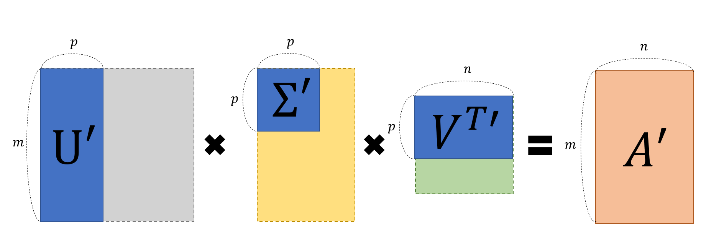

# SVD 특이값 분해

특이값 분해는 임의의 $m\times n$차원의  행렬 $A$에 대하여 다음과 같이 행렬을 분해할수 있는 방법이다.

$$
A = U \Sigma V^T
$$

여기서 $U$는 $m\times m$ 직교행렬, $\Sigma$는 $m\times n$ 대각행렬, $V$는 $n\times n$ 직교행렬이다.

### 직교행렬 (Orthogonal Matrix)

행렬 $U$가 직교행렬이라는 것은 다음과 같은 성질을 만족한다는 것을 의미한다.

$$
U^T U = U U^T = I
$$

이에 따라 $U^T = U^{-1}$이 성립한다.

### 대각행렬 (Diagonal Matrix)

대각행렬은 주대각선을 제외한 모든 원소가 0인 행렬을 의미한다. 대각행렬은 다음과 같이 표현된다.

$$
\Sigma = \begin{bmatrix}
\sigma_1 & 0 & \cdots & 0 \\
0 & \sigma_2 & \cdots & 0 \\
\vdots & \vdots & \ddots & \vdots \\
0 & 0 & \cdots & \sigma_n
\end{bmatrix}
$$

## 특이값 분해의 기하학적 의미

> 직교하는 벡터 집합에 대하여, 선형 변환 후에 그 크기는 변하지만, 여전히 직교할 수 있게 되는 벡터 집합으로 분해하는 것

### 2차원 행렬의 특이값 분해

2차원 행렬 $A$에 대하여 특이값 분해를 하면 다음과 같이 표현된다.
$$
A = \begin{bmatrix}
0.25 & 0.75 \\
1 & 0.5
\end{bmatrix}
$$

임의의 벡터 $\mathbf{x} = \begin{bmatrix} x_1 \\ x_2 \end{bmatrix}$에 대하여 $A\mathbf{x}$를 계산하면 다음과 같다.

$$
A\mathbf{x} = \begin{bmatrix}
0.25 & 0.75 \\
1 & 0.5
\end{bmatrix} \begin{bmatrix} x_1 \\ x_2 \end{bmatrix} = \begin{bmatrix} 0.25x_1 + 0.75x_2 \\ x_1 + 0.5x_2 \end{bmatrix}
$$

그렇다면, 직교하는 두 벡터$(\mathbf x, \mathbf y)$에 대해 동시에 선형 변형을 시켜본다면, 선형 변환 후의 결과가 직교하는 경우를 찾을 수 있을까?

$$
A\mathbf x = 
\begin{bmatrix}
0.25 & 0.75 \\
1 & 0.5
\end{bmatrix} \begin{bmatrix} x_1 \\ x_2 \end{bmatrix} = \begin{bmatrix} 0.25x_1 + 0.75x_2 \\ x_1 + 0.5x_2 \end{bmatrix}
$$

$$
A\mathbf y = 
\begin{bmatrix}
0.25 & 0.75 \\
1 & 0.5
\end{bmatrix} \begin{bmatrix} y_1 \\ y_2 \end{bmatrix} = \begin{bmatrix} 0.25y_1 + 0.75y_2 \\ y_1 + 0.5y_2 \end{bmatrix}
$$

위의 두 결과를 그래프로 나타내면 다음과 같다.

[소스코드](./src/svd.py)

주목해야하는 것은 두가지로 다음과 같다.

1. $A\mathbf x$와 $A\mathbf y$가 직교하는 경우는 단 한번만 존재하지는 않다.
2. $A\mathbf x$와 $A\mathbf y$는 $A$라는 행렬을 통해 변환되었을 때, 길이가 변한다.
    * 이 값을 singular value라고 하고, 크기가 큰 순서대로 정렬시키며, $\sigma_1, \sigma_2, ...$로 표현한다.
  

임의의 $m\times n$ 행렬 $A$에 대하여 특이값 분해를 하면 다음과 같이 표현된다.

$$
A = U \Sigma V^T
$$

선형 변환 전의 직교하는 벡터 $\mathbf x$, $\mathbf y$는 다음과 같이 열벡터 모음으로 생각할수 있으며, 이를 $V$라고 표현한다.

$$
V = \begin{bmatrix} \mathbf x & \mathbf y & ... \end{bmatrix}
$$

선형 변환 후의 직교하는 벡터 $A\mathbf x$, $A\mathbf y$에 대하여 정규화한 벡터를 $\mathbf u_1$, $\mathbf u_2$라고 하면 다음과 같이 표현된다.

$$
U = \begin{bmatrix} \mathbf u_1 & \mathbf u_2&... \end{bmatrix}
$$

마지막으로 특이값을 대각행렬로 표현하면 다음과 같다.

$$
\Sigma = \begin{bmatrix}
\sigma_1 & 0 & \cdots & 0 \\
0 & \sigma_2 & \cdots & 0 \\
\vdots & \vdots & \ddots & \vdots \\
0 & 0 & \cdots & \sigma_n
\end{bmatrix}
$$

선형 변환의 관점에서 네개의 행렬 ($A$, $V$, $\Sigma$, $U$)의 관계는 다음과 같다.

$$
AV = U\Sigma
$$

$V$에 있는 열벡터를 $A$를 통해 선형 변환 했을때, 그 크기는 $\sigma_1, \sigma_2, ...$만큼 변하지만, 여전히 직교하는 벡터 $\mathbf u_1, \mathbf u_2, ...$를 찾을 수 있을까?

$V$는 직교 행렬이브로 $V^T V = I$이 성립한다. 이에 따라 $V^T = V^{-1}$이 성립한다. 따라서 다음과 같이 표현할 수 있다.

$$
AV = U\Sigma \Rightarrow A = U\Sigma V^T
$$

## 특이값 분해의 목적

특이값 분해는 다음과 같다.

$$

A = U \Sigma V^T

= \begin{bmatrix} \mathbf u_1 & \mathbf u_2 & ... \end{bmatrix} \begin{bmatrix}
\sigma_1 & 0 & \cdots & 0 \\
0 & \sigma_2 & \cdots & 0 \\
\vdots & \vdots & \ddots & \vdots \\
0 & 0 & \cdots & \sigma_n 
\end{bmatrix}
\begin{bmatrix}
\mathbf v_1^T \\
\mathbf v_2^T \\
...
\end{bmatrix}
 = \sigma_1 \mathbf u_1 \mathbf v_1^T + \sigma_2 \mathbf u_2 \mathbf v_2^T + ...
$$

여기서 각 항$\mathbf u_1 \mathbf v_1^T$ 등은 $m\times n$ 행렬이며, $\mathbf u$, $\mathbf v$는 정규화 된 벡터이므로 $\mathbf u_1 \mathbf v_1^T$내의 성분은 -1에서 1사이의 값을 갖는다.

따라서, $\sigma_1 \mathbf u_1 \mathbf v_1^T$만 보았을때, 이 행렬의 크기는 $\sigma_1$에 의해 정해진다.

즉, SVD를 통해서 A라는 임의의 행렬을 여러개의 A행렬과 동일한 크기를 갖는 여러개의 행렬로 분해해서 생각할수 있고, 분해된 각 행렬의 원소의 크기는 $\sigma_1, \sigma_2, ...$에 의해 결정된다.

## 특이값 분해의 활용

특이값 분해는 분해되는 과정보다 분해된 행렬을 다시 조합하는 과정에서 활용된다.

기존의 $U, \Sigma, V^T$로 분해되어 있던 $A$행렬을 특이값 p개만을 이용해서 $A'$행렬로 '부분 복원'할 수 있다.
특이값의 크기에 따라 A의 정보량이 결정됙 때문에 값이 큰 몇개의 특이값을 이용해서 A'를 만들면, A의 정보량을 대부분 유지하면서도 행렬의 크기를 줄일 수 있다.
