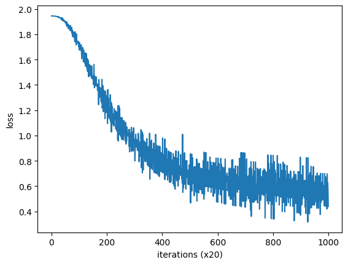

# word2vec

## 통계 기반 기법의 문제점.

통계 기반 기법에서는 주변 단어의 빈도를 기초로 단어를 표현했다.

구체적으로는 동시발생 행렬을 만들고, 그 행렬에 SVD를 적용하여 밀집벡터(단어의 분산 표현)를 얻었다.

하지만 실제 현업에서 다루는 corpus의 어휘수는 100만개 이상이며, 이는 동시발생 행렬의 shape이 100만 X 100만이 되어야 한다.

이런 거대한 행렬에 SVD를 적용하는것은 현실적이지 않다.
> SVD 기법은 O(n^3)의 시간복잡도를 가지기 때문이다.

## 추론 기반 기법

추론 기반 기법에서는 추론이 주된 작업이다. 추론이란 주변 `context`가 주어졌을 때 무슨 단어가 들어가는지 추측하는 작업이다.

$$
\text{you ??? goodbye and I asy hello.}
$$

## 신경망의 단어처리

신경망은 "you", "say"같은 단어를 직접 처리할 수 없기 때문에 단어를 '고정 길이의 벡터'로 변환해야 한다.
이때 사용하는 대표적인 방법은 원핫 벡터로 변환하는 것이다. 원핫 표현이란 벡터의 원소 중 하나만 1이고 나머지는 모두 0인 벡터를 말한다.


이제 단어를 벡터로 나타낼 수 있고, 신경망 계층들은 벡터를 처리할 수 있다. 즉, 단어를 신경망으로 처리할수 있게 되었다.


```python
# onehot.ipynb
c = np.array([[1, 0, 0, 0, 0, 0, 0]])
W = np.random.randn(7, 3)
h = np.matmul(c, W)
print(h)
print(W)
# [[ 0.53049115  0.80939883 -0.06515422]]

# [[-1.28467208 -0.31236871  0.00881346]
#  [ 0.8517237   0.80260893  0.35117362]
#  [-1.77088339  0.73824633 -2.64538116]
#  [ 1.1128839   0.58763038  0.79380275]
#  [ 0.01287326 -0.14879395  0.33680531]
#  [-0.48498518 -0.4472975  -0.14260649]
#  [ 0.54463527  0.59979248 -0.32314239]]
```

c는 원핫 인코딩 되어 있으므로, c와 W의 행렬곱은 W의 행벡터 중 하나를 '뽑아낸'것과 같다.


## CBOW 모델 (Continuous Bag of Words)

CBOW 모델은 context로부터 target을 추측하는 용도로 사용된다.

CBOW모델의 입력은 context이고, context는 "you", "goodbye", "and", "say"와 같이 단어들의 목록으로 구성되어 있다.


입력층이 2개 있고, 은닉층을 거져 출력층에 도달한다.
입력층이 2개인 이유는 context의 단어 수가 2개이기 때문이다.
context의 단어 수가 N개라면 입력층도 N개가 된다.

은닉충의 뉴런은 입력층의 완전연결계층에 의해 반환된 값이 되는데, 입력층이 여러개인 경우, 전체를 평균한 벡터가 된다.
출력층에서는 뉴런 하나하나가 단어에 대응한다. 또한 출력층 뉴런은 단어의 점수를 의미하며, 값이 높을수록 대응 단어의 출현 확률도 높아진다.


가장 앞단에 MatMul 계층이 2개 있고, 이 두 계층의 출력의 평균이 은닉층 뉴런이 된다. 다음으로, 은닉층에서 출력층으로 가는 MatMul 계층이 존재한다.

```python
# 샘플 context 데이터
c0 = np.array([[1, 0, 0, 0, 0, 0, 0]])
c1 = np.array([[0, 0, 1, 0, 0, 0, 0]])

# 가중치 초기화
W_in = np.random.randn(7, 3)
W_out = np.random.randn(3, 7)

# 계층 생성
in_layer0 = MatMul(W_in)
in_layer1 = MatMul(W_in)
out_layer = MatMul(W_out)

# 순전파
h0 = in_layer0.forward(c0)
h1 = in_layer1.forward(c1)
h = 0.5 * (h0 + h1)
s = out_layer.forward(h)

print(s)
#[[ 0.23718179 -0.15794509  0.1398977   0.06502093 -0.08007988 -0.07046796
#    0.06012722]]
```

입력층을 처리하는 MatMult 계층은 context 수만큼 생성하고, 출력층 계층은 하나만 생성한다.
이때, 입력층 측의 MatMul 계층은 가중치를 공유한다.

in_layer0과 in_layer1의 forward()를 호출하여, 중간데이터를 계산하고 평균내어 out_layer를 통과시켜 단어의 점수를 구한다.

## CBOW 모델의 학습

앞서 제작한 CBOW 모델은 출력으로 단어의 점수를 출력했다. 이 점수에 소프트맥스 함수를 적용하여 확률을 얻을 수 있다. 이 확률이란 컨텍스트가 주어졌을때 어떤 단어가 출현할 확률을 의미한다.


가중치가 적절히 설정되어 있다면, "you", "say"라는 컨텍스트가 주어졌을때 "goodbye"라는 단어가 높은 확률로 출력되어야 한다.

CBOW 모델에서는 당연하지만 신경망이 올바른 예측을 할 수 있도록 가중치를 조정하는 학습이 필요하다. 그 결과로 가중치 $W$에 단어의 출현 패턴을 파악한 벡터가 학습된다.

확률을 구하기 위해서 소프트맥스 함수를 사용했다면, 손실 함수로 크로스 엔트로피 오차를 사용하며, 구한 손실을 통해 가중치를 갱신한다.


### word2vec의 가중치와 분산표현

$W_{in}, W_{out}$ 두 가중치가 있다. 

여기서 단어의 분산 표현은 $W_{in}$의 행벡터로 정의한다.
왜냐하면 $W_{in}$은 입력층과 연결되어 있고, 입력층은 단어를 원핫 벡터로 표현하기 때문이다.
즉, $W_{in}$의 행벡터는 원핫 벡터와 내적을 취했을때, 원핫 벡터에 해당하는 단어의 분산 표현이 된다.

## 학습 데이터

### 컨텍스트와 타깃

word2vec에서 입력은 `컨텍스트`고 정답은 컨텍스트에 둘러싸인 `타깃`이다.
이제 해야 할 일은 신경망에 `컨텍스트`를 입력했을 때, `타깃`이 출현할 확률을 높여야 한다.

그러므로 코퍼스로부터 학습할 데이터: `컨텍스트와` `타깃`을 준비해야 한다.


`컨텍스트`의 각 행은 신경망으로 사용되고, 
`타깃`은 정답으로 사용된다.
또한 각 샘플 데이터에서 컨텍스트의 수는 여러개가 될 수 있지만, 타깃은 하나만 존재한다.


```python
def create_contexts_target(corpus, window_size=1):
    target = corpus[window_size: -window_size]
    contexts = []

    for i in range(window_size, len(corpus) - window_size):
        contexts = []
        for t in range(- window_size, window_size + 1):
            if t == 0:
                continue
            contexts.append(corpus[i - t])
        contexts.append(corpus[i])
    return np.array(contexts), np.array(target)

contexts, target = create_contexts_target(corpus, window_size=1)
print(contexts)
# [[0 2]
#  [1 3]
#  [2 4]
#  [3 1]
#  [4 5]
#  [1 6]]
print(target)
# [1 2 3 4 1 5]
```

이렇게 만든 맥락과 타깃을 원핫 벡터로 변환하여야 한다.


```python
def convert_one_hot(corpus, vocab_size):
    N = corpus.shape[0]

    if corpus.ndim == 1:
        one_hot = np.zeros((N, vocab_size), dtype=np.int32)
        for i, id in enumerate(corpus):
            one_hot[i, id] = 1
    
    elif corpus.ndim == 2:
        C = corpus.shape[1]
        one_hot = np.zeros((N, C, vocab_size), dtype=np.int32)
        for i, ids in enumerate(corpus):
            for j, id in enumerate(ids):
                one_hot[i, j, id] = 1
    return one_hot

text = "you say goodbye and I say hello."
corpus, word_to_id, id_to_word = preprocess(text)
contexts, target = create_contexts_target(corpus, window_size=1)
vocab_size = len(word_to_id)

target = convert_one_hot(target, vocab_size)
contexts = convert_one_hot(contexts, vocab_size)
```

##  CBOW 모델

```python
class SimpleCBOW:
    def __init__(self, vocab_size, hidden_size):
        V, H = vocab_size, hidden_size

        W_in = 0.01 * np.random.randn(V, H).astype('f')
        W_out = 0.01 * np.random.randn(H, V).astype('f')

        self.in_layer0 = MatMul(W_in)
        self.in_layer1 = MatMul(W_in)
        self.out_layer = MatMul(W_out)
        self.loss_layer = SoftmaxWitLoss()

        layers = [self.in_layer0, self.in_layer1, self.out_layer]
        slef.params, self.grads = [], []
        for layer in layers:
            self.params += layer.params
            self.grads += layer.grads

        self.word_vecs = W_in

    def forward(self, contexts, target):
        h0 = self.in_layer0.forward(contexts[:, 0])
        h1 = self.in_layer1.forward(contexts[:, 1])
        h = (h0 + h1) * 0.5
        score = self.out_layer.forward(h)
        loss = self.loss_layer.forward(score, target)
        return loss

    def backward(self, dout=1):
        ds = self.loss_layer.backward(dout)
        da = self.out_layer.backward(ds)
        da *= 0.5
        self.in_layer1.backward(da)
        self.in_layer0.backward(da)
        return None
```


```python
window_size = 1
hidden_size = 5
batch_size = 3

max_epoch = 1000

text = "You say goodbye and I say hello."
corpus, word_to_id, id_to_word = preprocess(text)

vocab_size = len(word_to_id)
contexts, target = create_contexts_target(corpus, window_size)
target = convert_one_hot(target, vocab_size)
contexts = convert_one_hot(contexts, vocab_size)

model = SimpleCBOW(vocab_size, hidden_size)
optimizer = Adam()
trainer = Trainer(model, optimizer)

trainer.fit(contexts, target, max_epoch, batch_size)
trainer.plot()
```



학습을 거듭할수록 손실이 줄어드는 것을 확인할 수 있으므로, 학습이 순조롭다는 것을 알 수 있다.

학습이 끝난 후의 가중치 매개변수를 확인해보자.
```python
word_vecs = model.word_vecs
for word_id, word in id_to_word.items():
    print(word, word_vecs[word_id])
# you [ 0.91027445  0.9109697   0.9093714  -1.636414    1.1909498 ]
# say [-1.2520131  -0.42286974 -1.2547204  -0.18793075  1.159552  ]
# goodbye [1.1790615  1.019854   1.1555815  0.59903586 0.61650884]
# and [-0.96715873 -1.5677291  -0.981955   -1.466045    0.82372546]
# i [1.1416799  1.0131328  1.1480596  0.6092619  0.56708306]
# hello [ 0.92347044  0.91841936  0.91537136 -1.6677319   1.1769753 ]
# . [-1.1574557  1.5436673 -1.1581074  1.3639181  1.2297388]
```

이제 단어를 밀집벡터로 표현할 수 있으며, 이 밀집 벡터가 단어의 분산 표현이다.

## CBOW와 확률

### 확률

$A$라는 사건이 발생할 확률은 $P(A)$로 나타낸다. $A$, $B$ 두 사건이 동시에 발생할 확률은 $P(A, B)$로 나타낸다. $A$가 발생했을 때 $B$가 발생할 확률은 $P(B|A)$로 나타낸다. 이때 $P(B|A)$는 조건부 확률(사후 확률)이라고 한다.

### CBOW 모델에서의 확률

CBOW모델은 컨텍스트가 주어졌을때, 타깃이 출현할 확률을 구한다.
코퍼스를 $w_1, w_2, w_3, \cdots, w_T$라고 하자. 이때 CBOW 모델은 다음과 같은 확률을 구한다.


$w_t-1, w_t+1$이 주어졌을때, 타깃이 $w_t$일 확률.
$$
P(w_t | w_{t-1}, w_{t+1})
$$

위 식을 사용하여, 손실함수를 간결하게 표현할 수도 있다.

사용한 손실함수 교차 엔트로피 오차는 다음과 같다.
$$
L = - \sum_k t_k \log y_k
$$

이때 $y_k$는 'k번째 해당하는 사건이 일어날 확률이다.'
그리고 $t_k$는 정답 레이블이며 원핫 벡터로 표현되기 때문에, 다음 식을 유도 할 수 있다.

$$
L = -log{P(w_t | w_{t-1}, w_{t+1})}
$$
위 식은 단순히 확률에 로그를 취하고 부호를 바꾼 것이다.
이 식을 음의 로그 우도(Negative Log Likelihood)라고 한다.
> 우도(Likelihood)란 어떤 사건이 발생할 확률을 의미하지만 해석과 활용이 확률과는 다르다.
> 확률 $P(x|\theta)$는 매개변수 $\theta$가 주어졌을때, 사건 $x$가 발생할 확률을 의미한다.
> 
>> 확률은 예측에 사용된다.
>> 만약 이 모델이 맞다면, 이런 데이터가 나올 확률은 얼마일까?
> 
> 반면 우도 $L(\theta|x)$는 사건 $x$가 발생했을때, 매개변수 $\theta$의 확률을 의미한다.
>
> > 우도는 매개변수 추정에 사용된다.
> > 만약 이 데이터가 맞다면, 어떤 $\theta$가 적합할까?

그렇다면 코퍼스 전체로 확장하면 다음과 같이 정리할 수 있다.

$$
L = - {1\over T}\sum_{t=1}^T log{P(w_t | w_{t-1}, w_{t+1})}
$$

## Skip-Gram 모델

Skip-Gram 모델은 CBOW 모델과 반대의 구조를 가지고 있다. 즉, 타깃을 입력으로 하고, 컨텍스트를 출력으로 한다.


skip-gram 모델은 입력층이 하나고 출력층은 컨텍스트의 수만큼 존재한다. 따라서 각 출력층에서는 개별적으로 손실을 구하고, 이 개별 손실들을 모두 더한 값을 최종 손실로 한다.

### Skip-Gram 모델의 확률

타깃 $w_t$가 주어졌을 때, 컨텍스트 $w_{t-1}, w_{t+1}$가 출현할 확률을 구한다.
$$
P(w_{t-1}, w_{t+1} | w_t)
$$
위 식은 $w_t$가 주어졌을때, $w_{t-1}, w_{t+1}$가 동시에 발생할 확률을 의미한다.
이때 skip-gram 모델에서는 $w_{t-1}, w_{t+1}$가 독립적이라고 가정한다. 즉, $w_{t-1}$와 $w_{t+1}$는 서로 영향을 주지 않는다는 것이다.(수학적으로는 조건부 독립이라고 하며, $P(A, B) = P(A)P(B)$로 표현된다.)

따라서 위 식은 다음과 같이 변형할 수 있다.

$$
P(w_{t-1}, w_{t+1} | w_t) = P(w_{t-1} | w_t) P(w_{t+1} | w_t)
$$
이제 위 식을 사용하여 손실함수를 정리할 수 있다.

$$
L = - {1\over T}\sum_{t=1}^T log{P(w_{t-1}, w_{t+1} | w_t)}
$$
$$
L = - {1\over T}\sum_{t=1}^T log{P(w_{t-1} | w_t)} + log{P(w_{t+1} | w_t)}
$$

식에서 알수 있다싶이, skip-gram 모델은 손실함수는 각 컨텍스트에서 구한 손실의 총합이어야 한다.

## word2vec 개선

앞에서 다룬 CBOW모델은 작은 코퍼스를 다룰 때는 문제될 것이 없지만, 대규모 코퍼스를 다룰 때는 문제가 발생한다.
어휘가 100만개 은닉층 뉴런이 100개인 CBOW 모델을 사용한다고 가정하자.


이때 두 계산에 많은 시간이 소요된다.

* 입력층의 원핫 표현과 가중치 행렬 $W_{in}$의 행렬곱
* 은닉층과 출력층의 가중치 행렬 $W_{out}$의 행렬곱 및 소프트맥스 함수의 계산
* 


단어의 원핫 표현도 100만 차원이고, 가중치 행렬도 100만 차원이다. 즉, 100만 X 100만의 행렬곱을 수행해야 한다.
그러나 이 행렬곱에서 수행하는 계산은 단지 행렬의 특정 행을 추출하는 작업이다.

## Embedding Layer 구현
```python

class Embedding:
    def __init__(self, W):
class Embedding:
    def __init__(self, W):
        self.params = [W]
        self.grads = [np.zeros_like(W)]
        self.idx = None

    def forward(self, idx):
        W, = self.params
        self.idx = idx
        out = W[idx]
        return out
```
사실 너무 쉬워서 설명 할 것도 없다. foward() 메서드에서 가중치 행렬 $W$의 특정 행을 추출하는 작업을 수행한다. 

역전파에서는 앞층에서 전해진 기울기를 그대로 전달하면 된다. 단, 앞 층으로부터 전해진 기울기를 가중치 기울이 $dW$의 특정 행에 설정해야 한다.

```python
def backward(self, dout):
    dW, = self.grads
    dW[...] = 0
    dW[self.idx] = dout
    return None
```

이렇게 끝난다면 좋겠지만, 배치 처리를 할 때 문제가 발생할 수 있다. 동일한 idx의 원소가 중복되는 경우, dout이 덮어써지게 된다.
그러므로 '할당'이 아닌 '누적'을 해야 한다.
```python
def backward(self, dout):
    dW, = self.grads
    dW[...] = 0
    for i, idx in enumerate(self.idx):
        dW[idx] += dout[i]
    return None
```
또한 for문 대신 최적화를 위해 numpy의 np.add.at()을 사용하여 구현할 수 있다.
```python
def backward(self, dout):
    dW, = self.grads
    dW[...] = 0
    np.add.at(dW, self.idx, dout)
    return None
```
### Negative Sampling

은닉층과 출력층 사이의 계산은 네거티브 샘플링을 통해 최적화 할수 있다. 네거티브 샘플링에서는 어휘가 아무리 많아져도 계산량을 낮은 수준에서 억제 할 수 있다.

### 은닉층 이후 계산의 문제점

은닉층 이후의 계산에서 오래 걸리는 부분은 다음과 같다.
* 은닉층의 뉴런과 가중히 행렬 $W_{out}$의 행렬곱
* 소프트맥스 함수의 계산
  
1. 은닉층의 벡터 크기가 100이고, 가중치 행렬 $W_{out}$의 크기가 100 X 100만이라면, 행렬곱의 계산량은 100 X 100만 = 10억이 된다.
이렇게 큰 행렬의 곱을 계산하기 위해서는 시간과 메모리가 많이 소요된다.
2. softmax계산에서도 같은 문제가 발생한다.
$$ y_k = \frac{e^{s_k}}{\sum_{j=1}^{1000000} e^{s_j}} $$

어휘 수가 100만개라면, 분모의 값을 얻기 위해서 $exp$계산은 100만번 수행해야 한다.

### 네거티브 샘플링

네거티브 샘플링을 이해하는데 중요한 포인트는 다중분류 (multi-class classification) 문제를 이진분류 (binary classification) 문제로 바꾼다(근사)는 것이다.

> 다중분류 문제란 여러 개의 클래스 중 하나를 선택하는 문제이다.|
>
> 이진분류 문제란 'Yes' 또는 'No'로 대답하는 문제이다.

CBOW모델은 컨텍스트가 주어졌을때, 타깃이 되는 단어를 추측하도록 만들어졌다. 예를 들어, **'you', 'goodbye'가 주어졌을때, 'say'라는 단어를 추측**하는 것이다.

이제는 위 문제를 이진 분류 문제로 바꿔야 한다. 그러기 위해서는 질문을 "yes/no"로 답할 수 있는 문제로 바꿔야 한다.
**예를들어 "you", "goodbye"라는 컨텍스트가 주어졌을때, 타깃은 "say"인가?** 라고 질문하는 것이다.

이런 질문을 하면 출력층에서는 뉴런이 하나만 존재하면 된다, 출력층의 뉴런은 'say'의 점수만을 출력한다.


은닉층과 출력 층의 가중치 행렬의 내적은 "say"에 해당하는 벡터만 추출하고, 그 추출된 벡터와 은닉층 뉴럭과의 내적만 계산하면 된다.


출력층의 가중치 $W_{out}$에는 단어 벡터가 열로 저장되어 있으므로, "say"에 해당하는 벡터를 추출하고, 그 벡터와 은닉층 뉴런과의 내적을 계산하면 된다.

### 시그모이드와 크로스 엔트로피 오차

신경망의 이진분류 문제에서는 점수에 시그모이드 함수를 적용하여 확률로 변환하고, 손실함수로 크로스 엔트로피 오차를 사용한다.

$$
y =  \frac{1}{1 + e^{-x}}\quad \text{(sigmoid)}
$$


$$
L = -t \log y - (1-t) \log (1-y) \quad \text{(cross entropy)}
$$
$t$ 값은 $0$ 혹은 $1$이며, $t$가 $1$이면 정답이 "yes"라는 의미이고, $t$가 $0$이면 정답이 "no"라는 의미이다. 따라서 $t$가 $1$이면 $-\log y$가 손실이 되고, $t$가 $0$이면 $-\log (1-y)$가 손실이 된다.


여기서 주목해야 하는 점은 역전파의 $y-t$값인데, 그 의미는 오차가 커기면, 그 오차가 앞 계층으로 전달되므로, 오차가 클스록 가중치가 크게 갱신된다. 반대로 오차가 작으면 가중치가 작게 갱신된다.

### 이진 분류 구현


은닉층 뉴런 $\mathbf h$와 가중치 행렬 $W_{out}$의 내적을 구하고, 그 결과에 sigmoid with loss 계층에 입력하여 최종적으로 손실을 얻는다.

#### Embedding Dot Layer

Embedding Dot Layer는 Embedding 계층과 Dot 계층을 합친 것이다. Embedding 계층은 원핫 벡터를 단어 벡터로 변환하는 계층이고, Dot 계층은 두 벡터의 내적을 구하는 계층이다.


```python
class EmbeddingDot:
    def __init__(self, W):
        self.embed = Embedding(W)
        self.params = self.embed.params
        self.grads = self.embed.grads
        self.cache = None
    
    def forward(self, h, idx):
        target_W = self.embed.forward(idx)
        out = np.sum(target_W * h, axis=1)

        self.cache = (h, target_W)
        return out
    
    def backward(self, dout)
    h, target_W = self.cache
    dout = dout.reshape(dout.shape[0], 1)

    dtarget_W = dout * h
    self.embed.backward(dtarget_W)
    dh = dout * target_W
    return dh
```


#### 네거티브 샘플링

지금까지 긍정적인 예(정답) 에 대해서는 학습 하였지만, 부정적인 예(오답)에 대해서는 학습하지 않았기 때문에 어떤 결과가 나올지 알 수 없다.

컨택스트가 "you", "goodbye"일때 "say"만 대상으로 이진 분류를 하였지만, "say"가 아닌 단어들도 존재한다. 이 단어들은 부정적인 예가 된다. 따라서 부정적인 예에 대해서도 학습을 해야 한다.
예를들어 "auto"라는 단어에 대해서는 어떤 대답을 할지 예상할 수 없다.

> 다중분류 문제를 이진 분류 문제로 바꾸기 위해서는 정답과 오답에 대해 각각 바르게 분류 할 수 있어야 한다. 따라서 긍정적 예와 부정적 예 모두 대상으로 문제를 생각해야 한다.

그렇다면 모든 부정적 예를 대상으로 학습하면 될까?
하지만 모든 부정적 예를 대상으로 학습하는 방법은 어휘수가 늘어나면, 감당할 수 없다. 그래서 근사적인 해결방법으로 부정적 예를 몇가지 선별(샘플링)하여 사용한다.

네거티브 샘플링 기법은 긍정적 예를 타깃으로 한 경우의 손실을 구하고, 동시에 부정적 예를 몇개 샘플링 선별하여 부정적 예에 대한 손실을 구한다. 그리고 각각의 데이터의 손실을 더한 값을 최종 손실로 한다.

예를들어 긍정적 예 "say", 부정정 예 "hello", "i" 를 샘플링 하였을대 다음과 같이 계산 그래프를 구성할 수 있다.


##### 샘플링 기법

샘플링 하는데 있어서, 가장 간단한 방법은 무작위로 샘플링 하는 것이다.

그러나 단순히 무작위로 샘플링하는 것보다 좋은 방법이 있는데, 말뭉치의 통계 데이터를 기초로 샘플링 하는 것이다. 코퍼스에서 자주 등장하는 단어는 많이 추출하고, 드물게 등장하는 단어는 적게 추출하는 것이다.

단어 빈도를 기준으로 샘플링 하려면, 말뭉치에서 단어의 출현 횟수를 확률 분포로 나타내고, 이 확률 분포를 사용하여 샘플링을 한다.


```python
import numpy as np

words = ['you', 'say', 'goodbye', 'I', 'hello', '.']

# 무작위 1개 샘플링
print(np.random.choice(words))
# you

# 무작위 5개 샘플링 중복=true
print(np.random.choice(words, size=5))
# ['you' 'say' 'you' 'I' 'you']

# 무작위 5개 샘플링 중복=false
print(np.random.choice(words, size=5, replace=False))
# ['you' 'say' 'I' '.' 'hello']

# 무작위 5개 샘플링 확률분포에 따라
p = [0.5, 0.1, 0.05, 0.2, 0.05, 0.1]
print(np.random.choice(words, size=5, p=p))
# ['.' 'goodbye' 'you' 'you' 'I']
```

`np.random.choice`를 사용하여 무작위로 샘플링을 할 수 있다.
* `size`: 샘플링할 개수
* `replace`: 중복여부
* `p`: 확률 분포

단, **`word2vec`** 에서는 확률분포에서 0.75제곱을 취할것을 권고한다.

$$
P'(w_i) = \frac{P(w_i)^{3/4}}{\sum_{j=1}^V P(w_j)^{3/4}}
$$

이런식으로 식을 수정하는 이유는 출현 확률이 낮은 단어를 '버리지 않기'위해서이다.

```python
p = [0.7, 0.29, 0.01]
new_p = np.power(p, 3/4)
new_p /= np.sum(new_p)
print(new_p)
#[0.64196878 0.33150408 0.02652714]
```
수정전 확률이 $1\%$였던  원소가 $2.65\%$로 증가한 것을 확인할 수 있다. 낮은 확률의 단어가 버려지지 않도록 확률을 조정한 것이다. 다만, 0.75라는 값은 경험적인 수치이므로 다른 값으로 대체될 수 있다.

#### UnigramSampler

UnigramSampler는 단어의 출현 확률을 기반으로 샘플링을 수행하는 클래스이다. 이 클래스는 단어의 출현 확률을 기반으로 샘플링을 수행하는 기능을 제공한다.

```python
corpus = np.array([0, 1, 2, 3, 4, 1, 2, 3])
power = 0.75
sample_size = 2

sampler = UnigramSampler(corpus, power, sample_size)
target = np.array([1, 3, 0])
negative_sample = sampler.get_negative_sampler(target)
print(negative_sample)
# [[0 3]
# [1 2]
# [2 3]]
```
위 코드에서는 긍정적 예로 [1, 3, 0] 3개의 데이터를 사용하고, 각각의 데이터에 대해 부정적 예를 2개씩 샘플링 하였다.

### 네거티브 샘플링 구현

```python
class NegativeSampling:
    def __init__(self, W, corpus, power=0.75, sample_size=5):
        self.sample_size = sample_size
        self.sampler = UnigramSampler(corpus, power, sample_size)
        self.loss_layers = [SigmoidWithLoss() for _ in range(sample_size + 1)]
        self.embed_dot_layers = [EmbeddingDot(W) for _ in range()]
        self.params, self.grads = [], []
        for layer in self.loss_layers:
            self.params += layer.params
            self.grads += layer.grads
```

초기화 메서드의 인수로 출력측 가중치를 나타내는 $W$와 코퍼스, 샘플링의 파라미터인 power, 샘플링할 개수인 sample_size를 받는다.

인스턴스 변수인 loss_layers와 embed_dot_layers에 원하는 계층을 리스트로 보관하는데, 부정적 예를 다루는 계층이 sample_size개이고 긍정적 예를 다루는 계층이 1개이므로, 총 sample_size + 1개의 계층을 생성한다.
또한 0번째 계층 loss_layers[0]과 embed_dot_layers[0]은 긍정적 예를 다루는 계층이고, 나머지 계층들은 부정적 예를 다루는 계층이다.

```python
def forward(self, h, target):
    batch_size = target.shape[0]
    negative_sample = self.sampler.get_negative_sample(target)

    # 긍정적 예 순전파
    score = self.embed_dot_layers[0].forward(h, target)
    correct_label = np.ones(batch_size, dtype=np.int32)
    loss = self.loss_layers[0].forward(score, correct_label)

    # 부정적 예 순전파
    negative_label = np.zeros(batch_size, dtype=np.int32)
    for i in range(self.sample_size):
        negative_target = negative_sample[:, i]
        score = self.embed_dot_layers[1 + i].forward(h, negative_target)
        loss += self.loss_layers[1 + i].forward(score, negative_label)

    return loss
```

인수로는 은닉층 뉴런 h와 긍정적 예의 타깃 target을 받는다. 우선 self.sampler를 이용하여 부정적 예를 샘플링하여 negative_sample에 저장하고, 긍정적 예와 부정적 예 각각의 데이터에 대해서 순정파를 수행해 그 손실을 더한다.

```python
def backward(self, dout=1):
    dh = 0
    for l0, l1 in zip(self.loss_layers, self.embed_dot_layers):
        dout = l0.backward(dout)
        dh += l1.backward(dout)
    return dh
```

역전파에서는 순전파의 역순으로 각 계층의 backward()를 호출하면 된다.
은닉측의 뉴런은 순전파시에 여러개로 복사되었으므로, 역전파때는 여러개의 기울기 값을 더해주면 된다.
