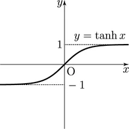

# RNN

## 확률과 언어모델

word2vec의 CBOW 모델에서는 $w_1, w_2, \cdots, w_T$라는 단어 시퀀스가 주어졌을 때, $w_t$를 예측하기 위해 $w_{t-1}, w_{t+1}$을 컨텍스트라고 하고, $w_t$를 타겟이라고 한다.

CBOW 모델은 $w_t$를 예측하기 위해 $w_{t-1}, w_{t+1}$을 사용하고 수식으로 나타내면 다음과 같다.
$$
P(w_t|w_{t-1}, w_{t+1})
$$

CBOW모델은 사후 확률을 모델링하는데, 이 사후 확률은 **$w_{t-1}과 w_{t+1}$이 주어졌을 때 $w_t$가 일어날 확률**을 의미한다.

지금까지는 컨텍스트를 좌우 대칭으로 설정하였지만, 컨텍스트는 왼쪽 윈도우만으로 한정할 수도 있으며, 식으로는 다음과 같이 나타낼 수 있다.

$$
P(w_t|w_{t-1}, w_{t-2})
$$
이때, CBOW모델이 다루는 손실함수는 다음과 같이 나타낼수 있다.
$$
L = -\log P(w_t|w_{t-1}, w_{t-2})
$$

CBOW모델이 학습으로 수행하는 것은 손실함수를 최소화하는 가중치 매개변수를 찾는 것이며, 이는 가중치 매개변수가 최적화 된 경우에 컨텍스트가 주어졌을 때, 타깃을 더 정확하게 추측할 수 있다는 것이다.

또한 학습을 수행하면, 그 부산물로 단어의 의미가 인코딩된 **단어의 분산표현**을 얻을 수 있다.


> 그런데, **컨텍스트로부터 타깃을 추측하는 것**의 쓸모는 뭐고, $P(w_t|w_{t-1}, w_{t-2})$는 어디에 사용할 수 있을까?

## 언어 모델

언어모델은 단어 나열에 확률을 부여하고, 특정한 단어의 시퀀스에 대해, 그 시퀀스가 일어날 가능성이 어느정도인지 확률로 평가한다.

예를들어 "you say goodbye"라는 단어 시퀀스에는 높은 확률을 출력하고, "you say good die" 에는 낮은 확률을 출력한다.

이 언어모델을 수식으로 나타내면 다음과 같다. $w_1, w_2, \cdots, w_m$이라는 $m$개의 단어로 된 문장을 생각했을 때, 단어가 $w_1, w_2, \cdots, w_m$일 확률을 $P(w_1, w_2, \cdots, w_m)$의 순서로 나타날 확률은 다음과 같다. 이때, 확률은 여러 사건이 동시에 일어날 확률이므로 동시 확률이라고 한다.

$$
\begin{align*}
P(w_1, w_2, \cdots, w_m) &= P(w_m|w_1, w_2, \cdots, w_{m-1}) P(w_{m-1}|w_1, w_2, \cdots, w_{m-2}) \cdots P(w_2|w_1) P(w_1) \\
&= \prod_{i=1}^m P(w_i|w_1, w_2, \cdots, w_{i-1})
\end{align*}
$$

> **확률의 곱셈정리**
>
> $A$와 $B$가 모두 일어날 확률 $P(A, B)$는 "$B$가 일어날 확률 $P(B)$"와 "$B$가 일어난 후 $A$가 일어날 확률 $P(A|B)$"의 곱으로 나타낼 수 있다.
> $$ P(A, B) = P(B)P(A|B) $$

위의 식에서 주목할만한 점은 사후 확률이 타깃 단어보다 왼쪽에 있는 모든 단어들을 컨텍스트로 사용한 경우의 확률이라는 점이다.

## CBOW 언어모델

word2vec CBOW 모델을 언어모델로 사용하는 방법은 컨텍스트의 크기를 특정값으로 한정하여 근사적으로 나타낼 수 있다.
$$
P(w_t|w_{t-1}, w_{t-2}, \cdots, w_{t-n}) = \prod^m_{t=1} P(w_t|w_{t-1}, w_{t-2}, \cdots, w_{t-1}) \approx \prod ^m_{t=1}P(w_t|w_{t-1}, w_{t-2})
$$

> ### 마크로프 모델
> 마르코프 모델은 미래의 상태가 현재 상테에만 의존해 결정되는 모델이다. 직전 상태만을 고려하는 모델을 1차 마르코프 모델이라고 하며, 직전 상태와 그 이전 상태를 모두 고려하는 모델을 2차 마르코프 모델이라고 한다.

위의 모델에서는 컨텍스트로 2개의 단어를 사용하는 예를 나타냈지만, 컨텍스트의 크기는 임의의 고정된 길이를 사용할 수 있다. 컨텍스트를 10, 100, 1000으로 설정할 수 있지만, 결국 그 컨텍스트를 벗어난 범위의 정보는 무시된다.

다만, 컨텍스트의 크기를 크게 설정할 수 있지만, CBOW 모델에서는 컨텍스트 안의 단어 순서가 무시 된다는 한계도 존재한다.
> CBOW 모델은 countinuous bag of words의 약자로 가방안의 단어라는 의미다. 가방안에는 단어들이 순서 없이 보관되어있다.


CBOW 모델의 은닉층에서는 단어 벡터들이 더해지기 때문에 컨텍스트의 순서가 무시된다.

상식적으로는 컨텍스트의 순서를 고려하여 모델을 설계하면 더 좋은 성능을 낼 것이라고 생각할 수 있다. 신경 확률론적 언어모델(Natural Probalbilistic Language Model)에서는 CBOW 모델을 확장하여 단어의 순서를 고려한 모델을 제안하였다. 그러나 단어의 순서를 고려하기 위해 연결하는 계층을 추가하는 것은 컨텍스트의 크기에 비례해 가중치 매개변수도 늘어나게 된다.


## RNN

RNN(Recurrent Neural Network)에서 `Recurrent`는 라틴어에서 유래된 단어로, '몇 번이나 반복해서 일어나는 일'이라는 의미이다. 그래서 한국어로 직역하면 순환 신경망이라고 한다.

순환한다는 것은 '반복해서 되돌아감'이라는 뜻이다. 주목해야 하는 사실은 순환하기 위해서는 '단힌 경로'가 필요하다는 점이다.

RNN의 특징은 닫힌 경로가 있기 때문에 이 닫힌 순환 경로를 따라 데이터가 끊임없이 순환 할 수 있다. 데이터가 순환하기 때문에 과거의 정보를 기억하는 동시에 최신 데이터로 갱신 될 수 있다.

먼저 RNN은 다음과 같은 다이어그램으로 표시 할 수 있다.


위 RNN 다이어그램은 순환 경로를 포함하고 있으며, 이 순환 경로를 따라 데이터를 계속 순환 시킬 수 있다.
입력으로는 $\mathbf x_t$가 들어오고, $t$는 시간을 의미한다.
시계열 데이터가 ($\mathbf x_1, \mathbf x_2, \cdots, \mathbf x_T$)가 RNN 계층으로 입력되는 것을 표현한 것이다.
또한 그에 따라 $\mathbf h_t$라는 은닉 상태가 생성된다.

각 $t$에 입력되는 $\mathbf x_t$가 벡터이며, 문장을 다루는 경우 각 단어의 분산 표현이 $\mathbf x_t$에 해당한다.

### 순환구조 전개

RNN의 순환구조는 지금까지는 존재하지 않던 구조이다.


이전까지의 피드포워드 신경망에서는 데이터가 계층을 진행하면서 서로 다른 계층을 지나갔지만, RNN에서는 **같은 계층**을 여러번 지나가게 된다.

각 시각의 RNN계층은 그 계층으로의 입력 $\mathbf x_t$와 전의 RNN계층의 출력을 입력으로 받는다. 그리고 그 출력을 계산한다.

$$
\mathbf h_t = \tanh(\mathbf h_{t-1} \mathbf W_{h} + \mathbf x_t \mathbf W_{x} + b)
$$

RNN에는 가중치가 2개 존재하는데, 입력 $\mathbf x$를 출력 $\mathbf h$로 변환하는 가중치 $\mathbf W_x$와 이전 RNN 출력 $\mathbf h_{t-1}$을 변환하는 가중치 $\mathbf W_h$ 이다. 또한 편향 $b$도 존재한다.

수식에서는 행렬곱계산하고 tanh 함수를 적용하여 $\mathbf h_t$를 계산한다.

> hyperbolic 함수는 쌍곡선 함수를 의미한다.
>
> $\tanh$함수는 $\tanh(x) = \frac{\sinh x}{\cosh x} 로 정의되며,
> 
> $\sinh x = \frac{e^x - e^{-x}}{2}$, $\cosh x = \frac{e^x + e^{-x}}{2}$로 정의으로 정의되기 때문에
>
> $\tanh x = \frac{e^x - e^{-x}}{e^x + e^{-x}}$로 정의된다.
> 
> 

계산된 $\mathbf h_t$는 다른 계층을 향해 전달되는 동시에, 다음 시각의 RNN계층(자기자신)으로도 전달된다.

현재의 출력($\mathbf h_t$)는 이전 출력($\mathbf h_{t-1}$)에 기초해 계산되며, 이는 RNN계층이 $\mathbf h$라는 **상태**를 갖고 있다고 해석할수 있다.

### BPTT

RNN의 학습도 다른 신경망과 같이 역전파로 진행할 수 있다.
즉, 먼저 순전파를 수행하고, 이어서 역전파를 수행하여 원하는 기울기를 구할 수 있다. 단, RNN의 오차 역전파법은 *시간 방향으로 펼친 신경망의 오차역전파법*이라는 의미에서 BPTT(Back Propagation Through Time)라고 불린다.


### Truncated BPTT

긴 시계열 데이터를 취급하는 경우에는 신경망 연결을 적당한 길이로 끊는다. 시간축 방향으로 긴 신경망을 적당한 지점에서 잘라내어 작은 신경망 여러 개로 만드는 아이디어를 사용한다. 이 방법을 Truncated BPTT라고 한다.

Truncated BPTT에서는 신경망의 연결을 끊지만, 역전파의 연결만 끊어야 하고, 순전파의 연결을 유지해야 한다.

예를들어 코퍼스의 길이가 1,000인 데이터의 경우, RNN계층을 펼쳤을때, 가로로 1,000개가 늘어선 모양의 신경망이 된다. 오차역전파를 사용하면, 아무리 계층이 늘어나더라도 계산할 수는 있지만, 너무 길면 계산량과 메모리 사용량이 문제가 되고, 계층이 길어짐에 따라, 신경망을 통과하면서 기울기 값이 줄어들어 기울기 소실 문제가 발생할 수 있다.


Truncated BPTT에서 중요한 것은 역전파의 연결은 끊어지지만, 순전파의 연결은 끊어지지 않는다는 것이다. 그렇기 때문에 RNN에서는 데이터를 무작위가아닌 순서대로 입력해야 한다.

예를 들어 두번째 블록에서는 앞블록의 마지막 은닉상태 $\mathbf h_9$가 필요하기 때문에 순전파는 유지된다.


### Truncated BPTT의 미니배치

미니배치 학습을 수행하기 위해서는 배치 방식을 고려하여, 데이터를 순서대로 입력해야하고, 데이터를 주는 시작 위치를 각 미니배치의 시작 위치로 옮겨야 한다.

예를들어 길이가 1,000인 데이터를 데이터의 길이 10, 미니배치 크기 2로 Truncated BPTT로 학습하기 위해서는 RNN계층의 입력 데이터로, 첫번째 미니배치때는 처음부터 순서대로 데이터를 제공해야 하고, 두번째 미니배치 때는 500번째 데이터를 시작위치로 정하고, 그 위치부터 순서대로 데이터를 제공해야한다.


첫번째 미니배치 원소는 $(\mathbf x_0, \mathbf x_1, \cdots, \mathbf x_{9})$이고 두번째 미니배치 원소는 $(\mathbf x_{500}, \mathbf x_{501}, \cdots, \mathbf x_{509})$이다.
이때, 두번째 미니배치의 첫번째 원소는 첫번째 미니배치의 마지막 원소와 연결되어야 한다. 즉, 두번째 미니배치의 첫번째 원소는 $\mathbf h_9$가 되어야 한다.
데이터를 순서대로 입력하다가 끝에 도달하면, 다시 처음부터 입력하도록 하여야 한다.
이렇듯 Truncated BPTT는 단순하지만, 주의해야 할점이 몇가지 있다.
* 데이터를 순서대로 제공
* 미니배치 별로 데이터를 제공하는 시작위치 이동

## RNN 구현

길이가 $T$인 시계열 데이터를 받는 RNN을 구현한다.
입력으로는 $\mathbf xs = (\mathbf x_0, \mathbf x_1, \cdots, \mathbf x_{T-1})$가 들어오고, 출력으로는 $\mathbf hs$가 나온다.


여기서는 T개 단계분의 작업을 한꺼번에 처리하는 계층을 TimeRNN계층이라고 한다.

### RNN 계층

RNN의 순전파는 다음 수식으로 표현된다.
$$
\mathbf h_t = \tanh(\mathbf h_{t-1} \mathbf W_{h} + \mathbf x_t \mathbf W_{x} + b)
$$

차원을 확인해보자
미니배치 크기가 $N$, 입력 차원이 $D$, 은닉 상태 차원이 $H$라고 하자.

$$
\begin{align*}
\mathbf h_{t-1} && \mathbf W_{\mathbf h} &+& \mathbf x_t && \mathbf W_{\mathbf x} &=& \mathbf h_t \\
(N\times H) && (H\times H) & & (N\times D) && (D\times H) && (N\times H) \\
\end{align*}
$$

```python
class RNN:
    def __init__(self, Wx, Wh, b):
        self.params = [Wx, Wh, b]
        self.grads = [np.zeros_like(Wx), np.zeros_like(Wh), np.zeros_like(b)]
        self.cache = None
    
    def forward(self, x, h_prev):
        Wx, Wh, b = self.params
        t = np.matmul(h_prev, Wh) + np.matmul(x, Wx) + b
        h_next = np.tanh(t)
        self.cache = (x, h_prev, h_next)
        return h_next
```


### RNN 계층의 역전파
RNN 계층의 역전파는 다음과 같다.
```python
def backward(self, dh_next):
    Wx, Wh, b = self.params
    x, h_prev, h_next = self.cache

    dt = dh_next * (1 - h_next ** 2)
    db = np.sum(dt, axis=0)
    dWh = np.matmul(h_prev.T, dt)
    dh_prev = np.matmul(x.T, dt)
    dWx = np.matmul(x.T, dt)
    dx = np.matmul(dt, Wx.T)

    self.grads[0][...] = dWx
    self.grads[1][...] = dWh
    self.grads[2][...] = db

    return dx, dh_prev
```

> `dt = dh_next * (1-h_next ** 2)`는 tanh의 미분을 구하는 방법이다.
> 
>`tanh`의 미분은 $1 - \tanh^2(x)$로 나타낼 수 있다. 따라서 $h_t$에 대한 미분은 $dh_t = dh_{t+1} * (1 - h_t^2)$로 나타낼 수 있다.

### Time RNN 계층 구현

Time RNN 계층은 여러개의 RNN 계층을 연결한 것이다. 


TimeRNN 계층에서는 은닉상태 $\mathbf h$를 인스턴스 변수로 유지하고, 이 변수를 인계받는 용도로 사용한다.


이렇게 하면 Time RNN을 사용할때는 RNN계층 사이의 은닉상태를 인계하는 작업을 수동으로 하지 않아도 된다.
```python
class TimeRNN:
    def __init__(self, Wx, Wh, b, stateful=False):
        self.params = [Wx, Wh, b]
        self.grads = [np.zeros_like(Wx), np.zeros_like(Wh), np.zeros_like(b)]
        self.layers = None

        self.h, self.dh = None, None
        self.stateful = stateful
    
    def set_state(self, h):
        self.h = h
    def reset_state(self):
        self.h = None
```
`layers`변수는 다수의 RNN계층을 리스트로 저장하는 용도로 사용한다.
`stateful`변수가 `True`인경우 Time RNN계층은 **상태가 있는** 상태이며, **상태가 있다**는 의미는 은닉상태를 유지하고, 순전파를 끊지 않고 전파한다는 의미이다.

```python
def forward(self, xs):
    Wx, Wh, b = self.params
    N, T, D = xs.shape()
    D, H = Wx.shape

    self.layers = []
    hs = np.empty((N, T, H), dtype='f')

    if not self.stateful or self.h is None:
        self.h = np.zeros((N, H), dtype='f')
    
    for t in range(T):
        layer = RNN(*self.params)
        self.h = layer.forward(xs[:, t, :], self.h)
        hs[:, t, :] = self.h
        self.layers.append(layer)
    
    return hs
```
`forward(xs)`는 입력 `xs`을 받는다. `xs`는 $T$개 분량의 시계열 데이터를 하나로 모은 것이다. 따라서 미니배치 크기 $N$, 입력 벡터의 차원수 $D$, 에 따라, `xs`의 형상은 $(N, T, D)$가 된다.

$h$가 처음 호출되거나, stateful이 `False`인 경우에는 은닉상태를 영행렬로 초기화한다.

`hs = np.empty((N, T, H), dtype='f')`는 문장에서 출력값을 담을 그릇으로, $T$회 반복하는 루프에서 RNN계층을 생성하여 layers에 추가하고, 은닉상태를 업데이트한다. 그리고 마지막에 $h$를 반환한다.


역전파의 경우에는 상류층에서 전해지는 기울기 $\mathbf{dhs}$를 받아 $\mathbf{dxs}$를 계산한다. 

그런경우 $t$번째 역전파는 다음과 같이 나타난다.


$t$번째 RNN계층에는 상류에서 전달된 기울기 $\mathbf{dh_t}$가 들어오고, 미래에서 전달된 기울기 $\mathbf{dh_{next}}$가 들어온다. 순전파에서 출력이 2개로 분기하여 전파했으므로, 역전파에서도 각 기울기가 합산되어 전해지므로 RNN계층에는 ($\mathbf{dh_t} + \mathbf{dh_{next}}$)가 들어온다.
```python
def backward(self, dhs):
    Wx, Wh, b = self.params
    N, T, H = dhs.shape
    D, H = Wx.shape

    dxs = np.empty((N, T, D), dtype='f')
    dh = 0
    grads = [0, 0, 0]
    for t in reversed(range(T)):
        layer = self.layers[t]
        dx, dh = layer.backward(dhs[:, t, :]+dh) #합산된 기울기
        dxs[:, t, :] = dx

        for i, grad in enumerate(layer.grads):
            grads[i] += grad
    
    for i, grad in enumerate(grads):
        self.grads[i][...] = grad
    self.dh = dh

    return dxs
```
Time RNN계층안에는 RNN계층이 여러개 존재하지만, 그 RNN 계층들에서는 똑같은 가중치를 사용하고 있기 때문에 최종 가중치의 기울기는 각 RNN계층의 가중치를 모두 더한 값이 된다.

중요한점은 순전파 때와는 반대 순서로 RNN계층의 backward 메소드를 호출해야 한다는 점이다.


## 시계열 데이터 처리 계층 구현

### RNNLM (RNN Language Model)


첫번째 층은 Embedding 계층으로 단어 ID를 단어의 분산표현으로 변환하고, 분산표현은 RNN계층으로 입력된다.
RNN계층은 은닉 상태를 다음 층으로 출력함과 동시에 다음 시각의 RNN계층으로 출력한다.
RNN 계층이 출력한 은닉상태는 Affine 계층으로 전단되어 Softmax 계층으로 전달된다.


### Time 계층 구현

시계열 데이터를 한꺼번에 처리하는 계층을 Time Embedding, Time Affine 형태로 구현한다.


`Time Affine`계층은 `Affine`계층을 T개 준비해서, 각 시각의 데이터를 개별적으로 처리하면 된다.


`Time Embedding`계층 또한 `Embedding`계층을 T개 준비하여, 각 시각의 데이터를 개별적으로 처리하면 된다.

`Time Softmax`의 경우에는 손실 오차를 구하는 Cross Entropy Error계층 또한 구현하며 그림과 같은 구성을 만든다.


$\mathbf t$는 정답 레이블을 의미하며, $T$개의 손실을 계산한뒤, 그 손실을 합산하여 평균한 값을 최종손실로 한다.

$$
L = -\frac{1}{T} \sum_{t=1}^T L_t
$$

## RNNLM 학습과 평가

### RNNLM 구현


SimpleRnnlm클래스는 4개의 Time계층을 쌓아서 구성할 수 있다.

```python
class SimpleRnnlm:
    def __init__(self, vocab_size, wordvec_size, hidden_size):
        V, D, H = vocab_size, wordvec_size, hidden_size
        rn = np.random.randn

        #가중치 초기화 (Xavier 초기화)~~~~
        embed_W = (rn(v, D) / 100).astype('f')
        rnn_Wx = (rn(D, H) / np.sqrt(D)).astype('f')
        rnn_Wh = (rn(H, H) / np.sqrt(H)).astype('f')
        rnn_b = np.zeros(H).astype('f')
        affine_W = (rn(H, V) / np.sqrt(H)).astype('f')
        affine_b = np.zeros(V).astype('f')

        #계층 생성
        self.layers = [
            TimeEmbedding(embed_W),
            TimeRNN(rnn_Wx, rnn_Wh, stateful=True),
            TimeAffine(affine_W, affine_b)
        ]
        self.loss_layer = TimeSoftmaxWithLoss()
        self.rnn_layer = self.layers[1]

        self.params, self.grads = [], []
        for layer in self.layers:
            self.params += layer.params
            slef.grads += layer.grads
```
```python
def forward(self, xs, ts):
    for layer in self.layers:
        xs = layer.forward(xs)
    loss = self.loss_layer.forward(xs, ts)
    return loss

def backward(self, dout=1):
    dout = self.loss_layer.backward(dout)
    for layer in reversed(self.layers):
        dout = layer.backward(dout)
    return dout

def reset_state(self):
    self.rnn_layer.reset_state()
```

### 언어모델의 평가

언어 모델은 주어진 과거 단어로부터 출현할 단어의 확률 분포를 출력한다. 이때, 언어 모델의 성능을 평가하는 척도로 **퍼플렉시티(perplexity)** 라는 지표를 사용한다. 퍼플렉시티는 확률의 역수의 기하 평균으로 정의된다.

쉽게 한가지 예를 들면 "you"라는 단어를 입력했을때, 정답이 "say"인경우 출력또한 "say"이며, 출력이 0.8인 경우 이때의 퍼플렉시티는 $1/0.8 = 1.25$가 된다. 반대로 확률이 0.2라고 예측한 경우 퍼플렉시티는 $1/0.2 = 5$가 된다. 퍼플렉시티는 작을수록 좋다.

근데 이 퍼플렉시티라는 값은 직관적으로 뭘까?
분기수(number of branches)라고 생각할 수 있다. 분기 수란 다음에 취할 수 있는 선택사항의 수를 말한다. 예를들어 퍼플렉시티가 1.25라면, 다음에 출현할 수 있는 단어의 후보를 1개정도로 좁혔다는 듰이다.

입력데이터가 하나일때는 위와 같이 퍼플렉시티를 계산할 수 있지만, 여러개의 단어가 있을때는 어떻게 계산할까?
퍼플렉시티는 다음과 같이 정의된다.

$$
L = -\frac{1}{N}\sum_n\sum_k t_{nk}\log y_{nk}
$$
$$
\mathbf{perplexity} = \exp(L)
$$

### 학습코드
```python
# 학습 코드
# train_custom_loop.py
```

지금 까지와 거의 같지만 두가지 차이점이 있다.

1. **데이터 제공 방법**

    Truncated BPTT방식으로 학습을 수행하기 때문에 데이터는 순차적으로 주고 각각 미니배치에서 데이터를 읽는 시작 위치를 조정해야한다.
    코드에서는 offsets에 데이터를 읽기 시작하는 위치를 계산해 저장한다.

    훈련 할때는 time_idx를 1씩 늘려가며 코퍼스에서 time_idx위치의 데이터를 읽는데, offsets를 이용한다.
    또한 코퍼스를 읽는 위치가 코퍼스의 길이를 넘어가면 다시 처음부터 읽도록 한다.

2. **퍼플렉시티 계산**
    에포크를 진행하면서 퍼플렉시티를 구하기 위해, 에포크마다, 손실의 평균을 구하고, 그 손실을 퍼플렉시티로 변환한다.


학습을 진행할수록 퍼플렉시티가 낮아지는 것을 확인할 수 있으며, 마지막에는 1에 근접한다.

## Summary

* RNN은 데이터를 순환시켜 과거, 현재, 미래로 데이터를 계속 흘려보낸다.
* RNN은 계층 내부에 은닉상태를 기억하는 구조를 가지고 있다.
* 언어 모델은 단어 시퀀스에 확률을 부여하며, 조건부 언어모델(CBOW LM)은 지금까지의 단어 시퀀스로부터 다음에 출현할 단어의 확률을 계산한다.
* RNN은 이론적으로 아무리 긴 시계열 데이터라도, 중요 정보를 은닉상태에 기억해 둘 수 있다.