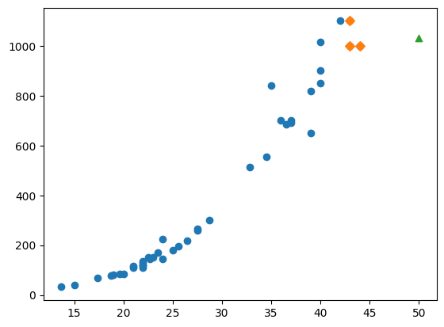
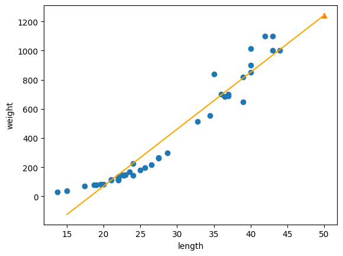
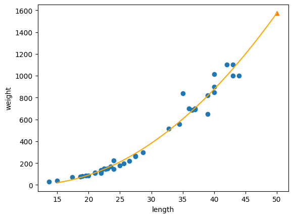

# regression

A supervised learning algorithm can be divided into classification and regression. Classification is a problem of classifying a sample into one of several classes, and regression is a problem of predicting an arbitrary value.

## K-Nearest Neighbors Regression

The K-Nearest Neighbors algorithm selects the k closest samples to the sample to be predicted, and calculates the average of the targets of these samples.


In scikit-learn, the K-Nearest Neighbors regression algorithm is provided as KNeighborsRegressor. This class makes it very easy to use KNN regression.
```python
from sklearn.neighbors import KNeighborsRegressor
knr = KNeighborsRegressor()
knr.fit(train_input, train_target)
# 0.992809406101064
```

In classification, the ratio of the number of samples in the test set that are correctly classified is given as accuracy. In regression, the score is evaluated using the coefficient of determination. This is also called $R^2$.

$$
R^2 = 1- { \sum_{i=1}^{n} (y_i - \hat{y}_i)^2 \over \sum_{i=1}^{n} (y_i - \bar{y})^2 }
$$

The coefficient of determination can be calculated using the above formula. It is the sum of the squares of the differences between the target and the predicted value of each sample, divided by the sum of the squares of the differences between the target and the target mean. If the prediction is close to the target, the coefficient of determination is close to 1, and if the prediction is about the target mean, it is close to 0.

## Overfitting and Underfitting


Training a model with a training set means that the model learns to fit the training set as well as possible. What happens if you evaluate this trained model on the training set and the test set? Generally, the score of the training set is slightly higher.

If the score is very good on the training set, but poor on the test set, the model is said to be **overfit**. Since it is a model that fits only the training set well, it will not work well when inferring the test set or new samples.

Conversely, if the score on the test set is higher than the training set, or if both scores are too low, the model is said to be **underfit**, and this can occur when the model is not sufficiently trained or when the size of the training set and test set is very small.


## Linear Regression

### Limitations of KNN Regression



k-nearest neighbors regression finds the closest samples and calculates the average of the targets. If the sample is located outside the range of the training set, it predicts the wrong value.

### Linear Regression

Linear regression is one of the first machine learning algorithms to learn because it is relatively simple and performs well. It is an algorithm that learns a straight line when there is one feature.




However, if you check the $R^2$ score for the training set and the test set,
```python
print(lr.score(train_input, train_target))
print(lr.score(test_input, test_target))
#>>>0.9398463339976041
#>>>0.824750312331356
```


The score of the test set is significantly lower than that of the training set, and the score of the training set is not close to 1. This means that the model is underfit. Also, when you check the graph, the linear graph predicted by the data does not represent the data well because the length is close to 0.

### Polynomial Regression

To draw a graph of a second-degree equation, the length must be squared and added to the training set.
```python
train_poly = np.column_stack((train_input ** 2, train_input))
test_poly = np.column_stack((test_input ** 2, test_input))
```




But is this a linear regression even though it is a second-degree equation? This is linear regression. Linear regression is an algorithm that learns a linear equation for features. By squaring the features and adding new features, linear regression can learn a second-degree equation.


```python
print(lr.score(train_poly, train_target))
print(lr.score(test_poly, test_target))
#>>>0.9706807451768623
#>>>0.9775935108325122
```