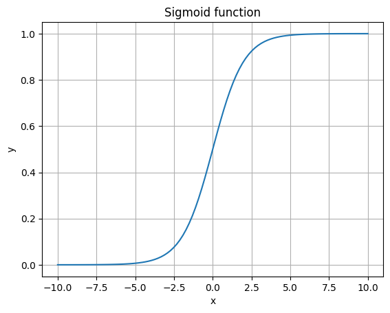

# 다양한 분류 알고리즘

## K-최근접 이웃 회귀

타깃 데이터에 2개 이상의 클래스가 포함된 문제를 다중분류(multiclass classification)라고 한다. 
KNN 알고리즘은 분류 문제에서도 사용할 수 있지만, 근거가 되는 확률이 1/n이므로 다중분류 문제에서는 잘 사용하지 않는다. 

## 로지스틱 회귀

로지스틱 회귀는 이름은 회귀이지만 분류 알고리즘이다.
선형 회귀와 동일하게 선형 방정식을 학습한다.

$$
z = a \times (Weight) + b \times (Length) + c \times (Diagonal) + d \times (Height) + e \times (Width) + f
$$
특성은 늘어났지만, 선형 방정식과 동일하다.
z를 0과 1사이의 확률로 바꾸기 위해,
시그모이드 함수 또는 로지스틱 함수를 사용하면, z가 매우 큰 음수일때 0이되고, z가 매우 큰 양수일때 1이 된다.

$$
\phi = \frac{1}{1+e^{-z}}
$$



> 넘파이 배열에서는 True, False값을 전달하여 행을 선택할 수 있고, 이를 불리언 인덱싱이라고 한다.
>```python
>char_arr = np.array(['A', 'B', 'C', 'D', 'E'])
>print(char_arr[[True, False, True, False, False]])
>#>>>['A' 'C']
>```

LogistricRegression은 기본적으로 이진 분류만 지원하기 때문에, 다중 분류를 하기 위해서는 반복 알고리즘을 사용해야 한다.
또한 LogisticRegression은 릿지 회귀와 같이 계수의 제곱을 규제한다. 이를 L2 규제라고 한다.
다만, LogisticRegression은 alpha 매개변수 대신 C 매개변수를 사용한다. C는 alpha의 역수이다.
값이 커지면, 규제가 작아진다는 뜻이다.

