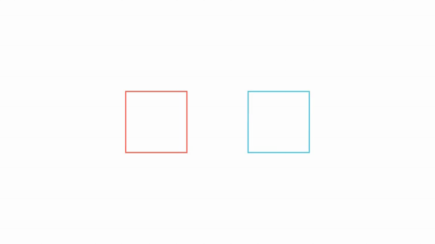

# Using `.animate` syntax to animate methods

## Animated square to circle
.animate is a powerful tool for converting Mobjects to animations in manim.
Using it, you can change a method call that performs a specific action to an animation instead of a static action.
This allow you to clearly understand the difference between static Mobjects manipulation and animated manipulation.
```python
class AnimatedSquareToCircle(Scene):
    def construct(self):
        self.camera.background_color = WHITE
        circle = Circle()
        square = Square(color=RED)
        
        self.play(Create(square))
        self.play(square.animate.rotate(PI/4))
        self.play(Transform(square, circle))
        self.play(square.animate.set_fill(BLUE, opacity=0.3))
        self.play(square.animate.flip(RIGHT))
        self.play(square.animate.shift(UP))
```

2. animate rotating the square by `PI/4` radians.
3. transforms the square into a circle.
4. changes the fill color of the square to blue with an opacity of 0.3.
5. flips the square to the right.
6. shifts the square up.

## Result of the animation


This example shows how to animate a square to a circle using the `.animate` syntax in manim.

## `.animate` vs Rotate

```python
class DifferentRotations(Scene):
    def construct(self):
        self.camera.background_color = WHITE
        left_square = Square(color=RED).shift(LEFT*2)
        right_square = Square(color=BLUE).shift(RIGHT*2)
        self.play(left_square.animate.rotate(PI/2), Rotate(right_square, PI/2), run_time=2)
        self.wait()
```
This code rotates the left square by `PI/2` using `.animate` and the right square using the `Rotate` method.
The `run_time` parameter is used to set the duration of the animation.

Looking at the code alone, it's hard to imagine that the two results would be different.
Let's see the result of the animation.

## Result of the animation


The left square rotates around its center, while the right square rotates around the origin.
This shows the difference between using `.animate` and the `Rotate` method in manim.

## Why?

Comparing the .animate and Rotate methods, you can see that they work differently, especially since `.animate` generates animations by interpolating between states, which can sometimes lead to unexpected results.

### problem

When the rotation angle is 180 degrees or greater, if the start state and end state are the same, `.animate` interprets the two states as the same, which can make the rotating animation look visually unnatural.

### solution

For simple transformations, you can use `.animate`, but for complex transformations(like rotation or scaling) where the interpolation results in unexpected behavior, it's safer to use a clear animation method like Rotate or Scale.