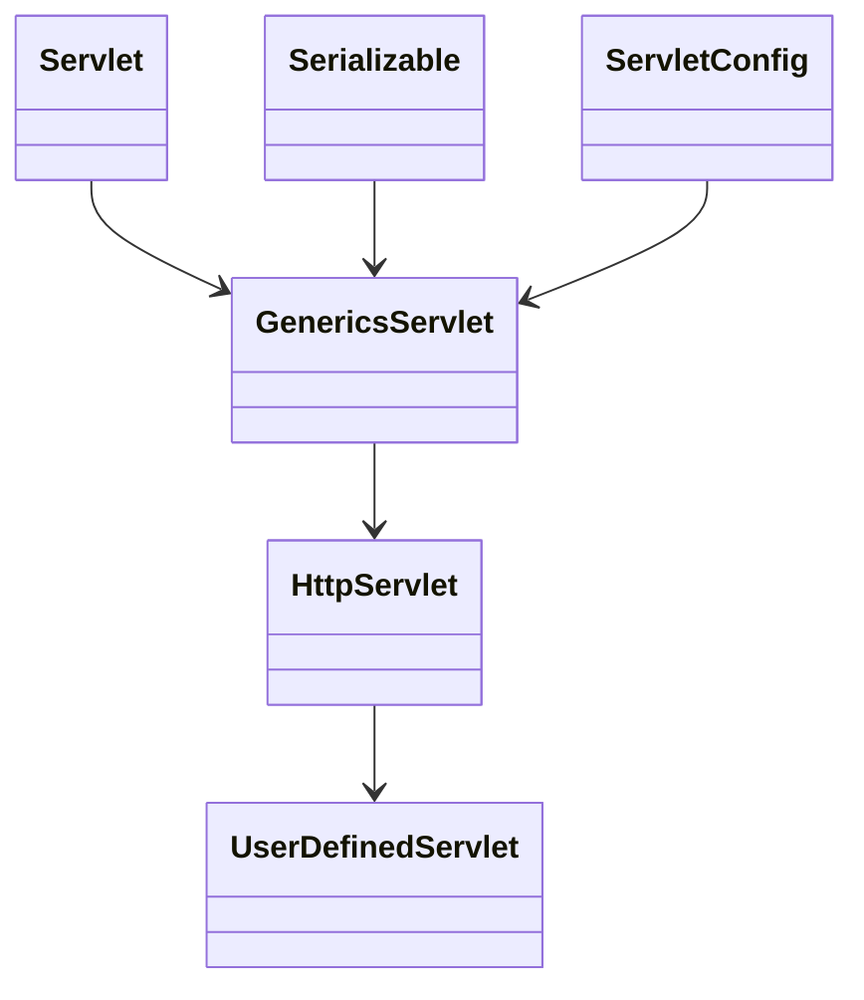

## WEB MVC

JSP만 이용한 개발방식은 유지 보수나 URL 변경등이 유연하지 못하기 때문에 2000년대 중반이후, 웹 개발은 거의 MVC 형식으로 서블릿과 JSP를 같이 사용하는 형태로 발전하였다.

서블릿 코드는 자바 코드를 그대로 이용할 수 있다는 장점이 있지만, HTML을 처리할 때 장황해지는 단점이 발생하며,

JSP의 경우에는 HTML을 바로 사용할 수 있지만, 자바 코드를 재사용해야하는 경우나, 자바 코드와 HTML이 혼재하는 상황등이 발생한다.

이를 개선하기 위해서 MVC구조를 사용하게 된다.

MVC에서는 브라우저의 요청을 해당 주소를 처리하는 서블릿에 전달하고, 서블릿 내부에서는 응답에 필요한 데이터를 준비한다.
서블릿은 준비한 데이터를 JSP로 전달하고 JSP에서는 EL을 사용하여, 결과 데이터를 생성한다.

웹 MVC구조는 `MODEL - VIEW - CONTROLLER`의 역할을 분리해서 처리하는 구조로 서블릿이 컨트롤러 역할이고, JSP가 뷰 역할이다.

컨트롤러 역할인 서블릿은 JSP에 필요한 데이터를 가공하는데, 이때 필요한 데이터를 제공하는 객체를 모델이라고 한다.

### PRG Pattern
Post-Redirect-Get Pattern

* 사용자는 컨트롤러에 원하는 작업을 POST 방식으로 처리하기를 요청
* POST 방식을 컨트롤러에서 처리하고 브라우저는 다른경로로 이동하는 응답
* 브라우저는 GET방식으로 이동

## HTTPServlet

### HttpServlet의 특징
* `doGet()`, `doPost()`를 제공하므로 필요한 메서드를 오버라이드하여, 처리를 나눠 할 수 있다.
* `HttpServlet`을 상속받은 클래스 객체는 WAS내부에서 자동으로 객체를 생성하고 관리하기 때문에, 객체 관리에 신경쓰지 않아도 된다.
* 멀티 스레드에 의해 동시에 실행될 수 있도록 처리 되기 때문에 해당 로직을 고민하지 않아도 된다.

### HttpServlet의 라이프사이클

1. 브라우저가 톰켓에 서블릿이 처리해야하는 특정한 경로를 호출한다.
2. 톰캣은 해당 경로에 적합한 서블릿 클래스를 로딩하고 객체를 생성한다.
    1. `init()`메서드를 호출하여, 서블릿 객체가 동작하기 전 작업을 처리한다.
3. 생성된 서블릿 객체는 `Request`를 분석하여, 파라미터들을 HttpServletRequest라는 타입의 파라미터로 전달받는다. 응답에 필요한 기능은 HttpServletResponse라는 타입의 객체로 전달받는다.
4. 서블릿 내부에서 GET/POST에 맞게 deGet()/doPost()등의 메서드를 실행한다.
5. 톰캣이 종료되는 시점에 서블릿의 destory() 메서드를 실행한다.

위 과정중 핵심은 1. 서블릿의 객체는 경로에 맞게 하나만 만들어진다는 점과, 호출시에는 doGet()/doPost()를 이용하여 처리된다는 점이다.

### HttpServletRequest의 주요 기능
doGet()/doPost()는 HttpServletRequest와 HttpServletResponse를 파라미터로 전달받는다.

HttpServletRequest의 주요 기능은 다음과 같다.

|기능 | 메서드 | 설명                               |
| --- | --- |----------------------------------|
| HTTP 헤더 관련 |  `getHeaderNames()`, `getHeader(String)` | HTTP 헤더 내용들을 찾는 기능               |
| 사용자 관련 | `getRemoteAddress()` | 접속한 사용자의 IP주소                    |
| 요청관련 | `getMethod()`, `getRequestURL()`, `getRequestURI()`, `getServletPath()` | GET/POST 정보, 사용자가 호출에 사용한 URL 정보 |
| 쿼리 스트링 관련 | `getParameter()`, `getParameterValues()`, `getParameterNames()` | 쿼리스트링 등으로 전달되는 데이터를 추출하는 용도      |
| 쿠키 관련 | `getCookies()` | 브라우저가 전송한 쿠키 정보                  |
| 전달 관련 | `getRequestdispatcher()` |                                  |
| 데이터 전달 | `setAttribute()` | 전달하기 전에 필요한 데이터를 저장하는 경우         |

#### `getParameter()`

쿼리스트링에서 키를 이용해서 밸류를 얻는 메서드, 리턴값은 항상 String이며, 해당 파라미터가 존재하지 않는다면, null을 반환한다.

#### `getParameterValues()`

`getParameter()`와 유사하지만, 동일한 이름의 파라미터가 여러개 존재하는 경우, String[]타입으로 반환받는다.

#### `setAttribute()`

JSP로 전달할 데이터를 추가할 때 사용한다. 키 밸류 형태로 데이터를 저장할 수 있으며, 키는 String이지만, 밸류는 모든 객체를 사용할 수 있다.
JSP에서는 서블릿에서 setAttribute()로 전달한 데이터를 화면에 출력한다.

#### `RequestDispatcher`

웹 MVC 구조에서는 HttpServletRequest.getRequestDispacher()를 사용하여 RequestDispatcher 타입의 객체를 얻을 수 있는데,
RequestDispatcher는 현재 요청을 다른 서버의 자원(서블릿, JSP 등)에게 전달하는 용도로 사용한다

* `forward()`: 현재까지의 모든 response내용을 무시하고 JSP가 작성하는 내용을 브라우저로 전달.
* `include()`: 현재까지의 response 내용 + JSP가 만든 내용을 브라우저로 전달.
* 
### HttpServletRequest의 주요 기능

| 기능      | 메서드              | 설명 |
|---------|------------------| --- |
| MIME 타입 | `setContentType()` | 응답 데이터의 종류를 지정 |
| 헤더      | `setHeader()` | 특정 이름의 HTTP 헤더 지정 |
| 상태      | `setStatus()` | 404, 200, 500 등 응답 상태 코드 지정 |
| 출력 | `getWriter()` | PrintWriteer를 이용해서 응답 메시지 작성 |
| 쿠키 관련 | `addCookie()` | 응답 시에 특정 쿠키 추가 |
| 전달 관련 | `sendRedirect()` | 브라우저에 이동을 지시 |

* `sendRedirect()`

`sendRedirect()`는 가장 많이 사용되는 HttpServletResoppnse메서드이다. HTTP의 Location 헤더로 전달되는데, 브라우저는 Location이 있는 응답을 받으면, 지정된 주소로 이동하고 다시 호출하게 된다.
브라우저의 주소가 아예 변겨오디기 때문에 새로고침 요청을 미리 방지할 수 있다